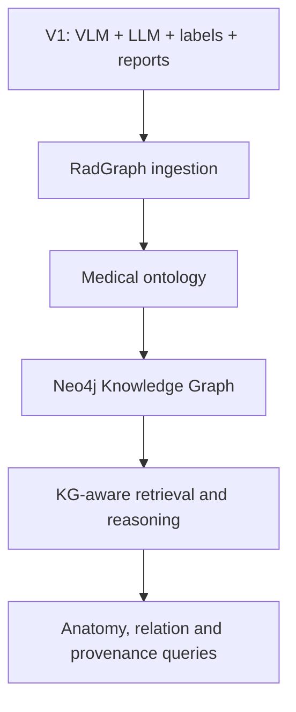
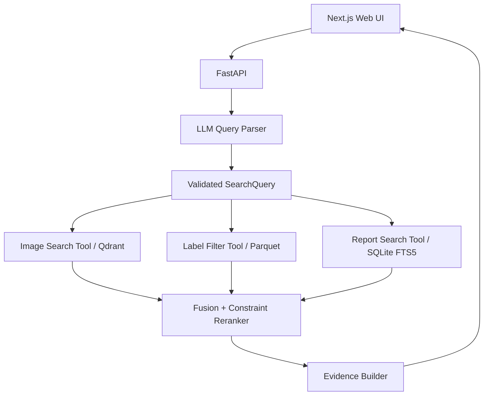

# Kế hoạch chi tiết V1: Hệ thống truy vấn ngữ nghĩa ảnh X-quang ngực sử dụng VLM và LLM

> **Tên tiếng Anh:** Semantic Chest X-ray Retrieval using Vision-Language Models and LLM-based Query Understanding  
> **Phiên bản tài liệu:** 1.0  
> **Mục tiêu:** Xây dựng POC hoàn chỉnh, chạy local bằng Docker, làm nền móng cho đồ án tốt nghiệp có Knowledge Graph  
> **Thời lượng đề xuất:** 8 tuần  
> **Dữ liệu ảnh:** CheXpert-v1.0-small, khoảng 11 GB  
> **Dữ liệu bổ sung:** CheXpert Plus reports/metadata/CheXbert labels khi join thành công  
> **Phạm vi corpus:** 25.000 study frontal, tối đa một ảnh/study  
> **Không thuộc V1:** RadGraph reasoning, Neo4j, ontology y khoa đầy đủ và truy vấn vị trí giải phẫu chi tiết

---

## 1. Tóm tắt dự án

V1 xây dựng một hệ thống cho phép người dùng tìm ảnh X-quang ngực bằng ngôn ngữ tự nhiên, ví dụ:

> Tìm ảnh X-quang thẳng có tim to và phù phổi nhưng không có tràn dịch màng phổi.

Hệ thống sử dụng:

1. **Vision-Language Model (VLM)** để biểu diễn ảnh và truy vấn text trong cùng không gian vector.
2. **LLM** để hiểu truy vấn tiếng Việt/Anh và chuyển thành điều kiện có cấu trúc.
3. **Structured label filters** để xử lý 14 nhãn CheXpert, phủ định và uncertainty.
4. **Report full-text search** nếu report CheXpert Plus join thành công.
5. **Hybrid retrieval** để kết hợp image similarity, report relevance và constraint matching.

Sản phẩm là một công cụ tìm kiếm/nghiên cứu, không phải hệ thống chẩn đoán.

### Chuỗi giá trị

```text
Kho ảnh X-quang khó tìm theo nội dung
        ↓
Người dùng nhập mô tả tự nhiên
        ↓
LLM hiểu ý định và cấu trúc điều kiện
        ↓
VLM tìm ảnh tương đồng
        ↓
Labels/report loại kết quả không thỏa điều kiện
        ↓
Top-K ảnh + thông tin giải thích
```

---

## 2. Câu hỏi nghiên cứu và giả thuyết

### 2.1. Câu hỏi nghiên cứu chính

> Việc kết hợp image-text embeddings với LLM-based query parsing và structured pathology filtering có cải thiện chất lượng truy vấn ảnh X-quang so với vector search hoặc label filtering đơn lẻ hay không?

### 2.2. Câu hỏi phụ

1. VLM chuyên biệt cho X-quang có truy xuất được ảnh phù hợp từ mô tả ngôn ngữ tự nhiên không?
2. LLM có ánh xạ chính xác truy vấn tiếng Việt/Anh vào 14 pathology, view và uncertainty không?
3. Structured filters có giảm vi phạm các điều kiện phủ định như “không có pleural effusion” không?
4. Report retrieval có cải thiện kết quả so với image vector retrieval đơn lẻ không?
5. Hệ thống có chạy được trên máy local với dung lượng và latency phù hợp cho POC không?

### 2.3. Giả thuyết

- Vector retrieval xử lý được semantic similarity nhưng yếu với phủ định và điều kiện Boolean.
- Label filtering xử lý đúng constraint nhưng không hiểu tốt mô tả tự nhiên và từ đồng nghĩa.
- LLM + vector + structured filters sẽ đạt constraint satisfaction và nDCG tốt hơn vector-only.
- Report retrieval sẽ cải thiện explanation và một phần ranking nếu image–report join đủ tốt.

---

## 3. Phạm vi V1 và ranh giới với đồ án tốt nghiệp

### 3.1. V1 bắt buộc hoàn thành

- Data audit và canonical corpus 25.000 study.
- Patient-level split chống leakage.
- Image embedding và Qdrant vector index.
- Text-to-image semantic search.
- LLM query parser có structured output.
- Mapping truy vấn vào 14 pathology.
- Include, exclude, explicit absence và uncertainty policies.
- Metadata/label filtering.
- Report search nếu join CheXpert Plus đạt gate.
- Hybrid ranking.
- Web UI, FastAPI và Docker Compose.
- Evaluation định lượng và error analysis.
- Documentation, demo script và non-diagnostic disclaimer.

### 3.2. Không thực hiện trong V1

- Neo4j.
- RadGraph entity/relation ingestion vào runtime.
- `LOCATED_AT`, `MODIFIES`, `SUGGESTIVE_OF` reasoning.
- UMLS, SNOMED CT hoặc RadLex ingestion đầy đủ.
- Truy vấn chi tiết như “left lower lobe opacity”.
- Graph visualization.
- Fine-tune VLM từ đầu.
- Tự động chẩn đoán hoặc đề xuất điều trị.
- PACS/HIS/FHIR integration.
- Cloud deployment hoặc production hardening.

### 3.3. Hướng phát triển đồ án tốt nghiệp



V1 phải thiết kế ID, data contracts và tool interfaces để V2 thêm Knowledge Graph mà không phải viết lại image ingestion, vector retrieval, API hoặc UI.

---

## 4. Người dùng và use cases

### 4.1. Người dùng mục tiêu

- Sinh viên/nghiên cứu viên y tế cần khám phá dataset.
- Kỹ sư AI y tế cần tìm case theo pathology.
- Bác sĩ/chuyên gia tham gia demo nghiên cứu, không sử dụng cho quyết định lâm sàng.

### 4.2. Use cases bắt buộc

1. Tìm ảnh có một pathology:

   ```text
   Find chest X-rays with cardiomegaly.
   ```

2. Tìm nhiều pathology:

   ```text
   Find cardiomegaly with pulmonary edema.
   ```

3. Tìm với explicit absence:

   ```text
   Find edema with no pleural effusion.
   ```

4. Tìm theo uncertainty:

   ```text
   Find cases where pneumonia is uncertain.
   ```

5. Tìm theo view:

   ```text
   Show frontal PA images with lung opacity.
   ```

6. Truy vấn tiếng Việt:

   ```text
   Tìm ảnh X-quang thẳng có tim to và phù phổi.
   ```

7. So sánh phương pháp:

   ```text
   Vector-only vs label-only vs hybrid.
   ```

### 4.3. Use cases không cam kết trong V1

- Left/right laterality.
- Upper/lower lobe reasoning.
- Quan hệ anatomy–finding.
- Tìm theo tiến triển nhiều lần chụp.
- Similar-image search bằng ảnh upload.
- Trả lời câu hỏi chẩn đoán.

---

## 5. Kiến trúc tổng thể



### 5.1. Nguyên tắc thiết kế

- LLM chỉ hiểu query; không trực tiếp quyết định ảnh nào đúng.
- Retrieval và ranking được thực hiện bằng code có thể kiểm thử.
- Không cho LLM sinh SQL tùy ý.
- Không cho LLM truy cập filesystem hoặc database trực tiếp.
- `ABSENT` không được đồng nhất với `NOT_MENTIONED`.
- Mọi kết quả phải truy vết được về `study_id`, `image_id`, label/report source.
- Hệ thống vẫn hoạt động ở chế độ image + labels khi report service không khả dụng.

### 5.2. Runtime services

| Service | Vai trò | Bắt buộc |
|---|---|---:|
| `web` | Next.js UI | Có |
| `api` | FastAPI orchestration | Có |
| `qdrant` | Image vector index | Có |
| `ollama` | Local LLM query parser | Có trong demo chuẩn; có rule fallback |
| `worker` | Offline ingestion/embedding | Chạy theo profile |

SQLite và Parquet được mount vào `api`, không cần service database riêng.

---

## 6. Technology stack

### 6.1. Backend và data

| Thành phần | Lựa chọn |
|---|---|
| Python | 3.11 |
| Package manager | `uv` |
| API | FastAPI + Pydantic v2 |
| Dataframe | Polars; Pandas chỉ khi thư viện nguồn yêu cầu |
| Columnar storage | Parquet/PyArrow |
| Text search | SQLite FTS5 |
| Vector DB | Qdrant |
| ML runtime | PyTorch + Transformers/model-specific package |
| Tests | Pytest |
| Lint/format | Ruff |

### 6.2. Frontend

| Thành phần | Lựa chọn |
|---|---|
| Framework | Next.js + TypeScript |
| Package manager | `pnpm` |
| Styling | Tailwind CSS |
| API state | TanStack Query hoặc fetch wrapper tối giản |
| E2E | Playwright |

### 6.3. Local deployment

- Docker Engine/Docker Desktop.
- Docker Compose.
- CPU path bắt buộc chạy được.
- GPU chỉ là optional override.
- Không yêu cầu Kubernetes.

### 6.4. Model strategy

#### VLM

- Candidate mặc định: XrayCLIP trong model zoo của Stanford AIMI.
- Chạy spike 1.000 ảnh trước khi khóa model.
- Model chỉ được chấp nhận nếu:
  - license phù hợp;
  - chạy được CPU;
  - có image encoder và text encoder tương thích;
  - query-to-image retrieval hoạt động;
  - model revision được pin.
- Không chạy full 25k trước khi hoàn tất model gate.

#### LLM

- Default local provider: Ollama.
- Default model nhỏ: `qwen2.5:3b` hoặc model tương đương đã được xác nhận trên máy.
- Temperature: `0`.
- Output: JSON theo Pydantic schema.
- Fallback bắt buộc: deterministic rule parser cho 14 pathology và view.
- Nếu thay model, không thay đổi query schema hoặc tool contracts.

---

## 7. Dữ liệu và corpus

### 7.1. Nguồn dữ liệu

```yaml
sources:
  images:
    name: chexpert-v1.0-small
    root: data/raw/CheXpert-v1.0-small
    format: jpg

  plus_metadata:
    name: chexpert-plus
    csv: data/raw/chexpert-plus/df_chexpert_plus_240401.csv
    chexbert_labels:
      findings: data/raw/chexpert-plus/labels/findings_fixed.json
      impression: data/raw/chexpert-plus/labels/impression_fixed.json
      report: data/raw/chexpert-plus/labels/report_fixed.json
```

RadGraph có thể được giữ trong raw data nhưng không được ingest vào runtime V1.

### 7.2. Join rules

```yaml
join:
  key: path_to_image
  allow_fuzzy_match: false
  min_full_join_rate: 0.95
  min_sample_join_rate: 0.95
```

Chuẩn hóa join key chỉ được phép thực hiện các thao tác xác định:

- chuyển `\\` thành `/`;
- loại prefix root cố định;
- loại whitespace đầu/cuối;
- chuẩn hóa duplicate separator;
- không approximate/fuzzy filename matching.

### 7.3. Corpus construction

Quy trình:

```text
Audit toàn bộ join candidates
        ↓
Lọc AP/PA frontal
        ↓
Tạo patient-level split
        ↓
Stratified sampling theo 14 labels
        ↓
Chọn tối đa một image/study
        ↓
Tạo sample manifest 25k
```

Không sample trước rồi mới join, vì có thể tạo corpus thiếu report không kiểm soát.

### 7.4. Corpus tiers

| Tier | Thành phần | Vai trò |
|---|---|---|
| A | Image + labels + impression/report | Dùng đầy đủ cho hybrid retrieval |
| B | Image + labels, thiếu report | Dùng cho vector + label retrieval |

Report không phải dependency cứng của toàn bộ sản phẩm.

### 7.5. Split

```yaml
sampling:
  seed: 20260101
  target_studies: 25000
  split_level: patient
  splits:
    development: 18000
    validation: 3500
    test: 3500
```

Không bao giờ chia theo image hoặc study nếu cùng patient có thể xuất hiện ở split khác.

### 7.6. Image preprocessing

CheXpert-v1.0-small đã có ảnh độ phân giải thấp; không upscale.

```yaml
preprocess:
  max_long_side: 512
  allow_upscale: false
  grayscale: true
  use_raw_jpg_for_embedding: true
  materialize_processed_images: false
  thumbnail_long_side: 256
  thumbnail_cache_ceiling_gb: 1
  batch_size: 512
```

- Đọc trực tiếp JPEG gốc để tạo embedding.
- Không tạo một bản WebP cho toàn bộ corpus.
- Thumbnail có thể tạo theo nhu cầu và cache có giới hạn.
- Lưu preprocessing config/hash cùng embedding build.

---

## 8. Data contracts

### 8.1. `images.parquet`

Một dòng trên mỗi ảnh được chọn:

```text
image_id: string
study_id: string
patient_id: string
path_to_image: string
local_image_path: string
view: FRONTAL
projection: AP | PA
dataset_split: train | valid
project_split: development | validation | test
image_checksum: string
width: int
height: int
```

### 8.2. `studies.parquet`

Một dòng trên mỗi study:

```text
study_id: string
patient_id: string
selected_image_id: string
project_split: string
corpus_tier: A | B
has_report: bool
has_impression: bool
has_findings: bool
ingestion_status: string
```

### 8.3. `labels.parquet`

Long format:

```text
study_id: string
concept: string
status: PRESENT | ABSENT | UNCERTAIN | NOT_MENTIONED
source: CHEXPERT_V1 | CHEXBERT_FINDINGS | CHEXBERT_IMPRESSION | CHEXBERT_REPORT
source_version: string
```

Không ghi đè assertion từ nhiều nguồn. Mọi xung đột được giữ lại cùng provenance.

### 8.4. `reports.parquet`

Một dòng trên mỗi study:

```text
study_id: string
patient_id: string
findings: string | null
impression: string | null
search_text: string
source_row_index: int
report_checksum: string
dataset_version: string
```

Report phải deduplicate theo study trước khi xây FTS index.

### 8.5. Stable IDs

- `path_to_image` chuẩn hóa là join key nguồn.
- `image_id = sha256(normalized_path_to_image)`.
- `study_id` được parse từ `train/patient.../study...`.
- Không sử dụng DataFrame row index làm primary key runtime.

---

## 9. Storage và disk budget

### 9.1. Cấu trúc lưu trữ

```text
data/
├── raw/
│   ├── CheXpert-v1.0-small/
│   └── chexpert-plus/
├── canonical/
│   ├── images.parquet
│   ├── studies.parquet
│   ├── labels.parquet
│   ├── reports.parquet
│   └── sample_manifest.parquet
├── indexes/
│   ├── report_search.sqlite
│   └── build_manifest.json
└── cache/
    └── thumbnails/

storage/
└── qdrant/
```

### 9.2. Disk guard

Nếu máy còn khoảng 100 GB:

```yaml
disk_guard:
  min_free_gb: 40
  project_ceiling_gb: 55
  staging_ceiling_gb: 8
  model_cache_ceiling_gb: 8
  thumbnail_cache_ceiling_gb: 1
  include_wsl_vhdx: true
```

Pipeline phải dừng trước khi:

- free space nhỏ hơn 40 GB;
- project vượt 55 GB;
- staging vượt 8 GB;
- model cache vượt quota.

### 9.3. Ước lượng

| Hạng mục | Dung lượng dự kiến |
|---|---:|
| CheXpert-small hiện có | 11 GB |
| CheXpert Plus metadata/report/labels | đo trong audit |
| Canonical Parquet/SQLite | dưới 1–2 GB mục tiêu |
| 25k vector 768 float32 | khoảng 77 MB vector thuần |
| Qdrant index + payload | dưới 1 GB mục tiêu |
| Model cache | 2–8 GB |
| Docker images/volumes | 5–12 GB |
| Cache/log/artifacts | 2–5 GB |

Lưu ý WSL VHDX có thể không tự thu nhỏ sau khi xóa file; disk audit phải kiểm tra cả filesystem trong WSL và dung lượng ổ Windows host.

---

## 10. LLM query parser

### 10.1. Trách nhiệm

- Nhận diện intent `SEARCH_CASES`.
- Chuẩn hóa tiếng Việt/Anh về 14 pathology.
- Trích include/exclude constraints.
- Nhận diện explicit absence.
- Nhận diện uncertainty.
- Trích AP/PA/frontal filters.
- Tạo semantic query cho VLM.

LLM không:

- chẩn đoán ảnh;
- truy cập Qdrant/SQLite trực tiếp;
- tạo SQL;
- thay đổi score;
- tạo evidence không tồn tại.

### 10.2. Query schema

```json
{
  "intent": "SEARCH_CASES",
  "semantic_query": "cardiomegaly with pulmonary edema",
  "include": [
    {"concept": "Cardiomegaly", "status": "PRESENT"},
    {"concept": "Edema", "status": "PRESENT"}
  ],
  "exclude_present": ["Pleural Effusion"],
  "explicit_absence": ["Pleural Effusion"],
  "uncertainty_policy": "EXCLUDE",
  "views": ["AP", "PA"],
  "top_k": 10,
  "language": "vi"
}
```

### 10.3. Validation

- Pydantic validation bắt buộc.
- Concepts phải thuộc allowlist 14 pathology.
- `top_k` giới hạn 1–50.
- Retry LLM tối đa một lần.
- Nếu lỗi tiếp: deterministic parser.
- UI hiển thị parsed query để người dùng kiểm tra.

### 10.4. Absence policy

Hai chế độ:

```text
EXCLUDE_PRESENT:
  loại study có finding = PRESENT

EXPLICIT_ABSENCE_REQUIRED:
  chỉ nhận study có finding = ABSENT
```

`NOT_MENTIONED` không được coi là `ABSENT`.

---

## 11. Retrieval design

### 11.1. Mode A — Label-only baseline

```text
Structured query
    ↓
Filter labels.parquet
    ↓
Matching studies
```

Mode này đo khả năng xử lý constraint nhưng không có semantic image similarity.

### 11.2. Mode B — Vector-only baseline

```text
semantic_query
    ↓
VLM text encoder
    ↓
Qdrant cosine search
    ↓
Top-K images
```

Default:

```yaml
vector_search:
  candidate_k: 100
  final_k: 10
  distance: cosine
```

### 11.3. Mode C — Hybrid proposed method

```text
LLM structured query
        ↓
Image candidates from Qdrant
        +
Report candidates from SQLite FTS
        ↓
Apply label/view constraints
        ↓
Rank fusion
        ↓
Top-K results
```

Defaults:

```yaml
retrieval:
  vector_candidate_k: 100
  report_candidate_k: 100
  final_k: 10
  fusion: rrf
  rrf_k: 60
  absence_policy: explicit_absence_required
  uncertain_include_policy: reject
```

### 11.4. Fusion

```text
candidate_set = union(vector_candidates, report_candidates)

base_score = RRF(vector_rank, report_rank)

if required label is PRESENT:
    add constraint bonus

if excluded label is PRESENT:
    remove result

if explicit absence required and label != ABSENT:
    remove result
```

Trọng số bổ sung chỉ được tuning trên validation queries, không dùng test queries.

### 11.5. Evidence

Result explanation lấy từ:

1. Report evidence span nếu có.
2. Structured labels với source/provenance.
3. Image similarity score.

Không diễn đạt label như một câu report của bác sĩ.

---

## 12. Tool contracts

V1 sử dụng deterministic orchestration. Tool interfaces được thiết kế để V2 có thể gắn vào agent runtime.

### 12.1. Image search tool

```python
search_image_embeddings(
    semantic_query: str,
    views: list[str] | None,
    candidate_k: int,
) -> list[ImageCandidate]
```

### 12.2. Label filter tool

```python
filter_studies_by_labels(
    include: list[LabelConstraint],
    exclude_present: list[str],
    explicit_absence: list[str],
    uncertainty_policy: str,
) -> set[str]
```

### 12.3. Report search tool

```python
search_reports(
    query: str,
    candidate_k: int,
) -> list[ReportCandidate]
```

### 12.4. Study detail tool

```python
get_study_details(
    study_ids: list[str],
) -> list[StudyDetails]
```

### 12.5. Runtime rule

LLM không được gọi tool theo vòng lặp không giới hạn. Backend chạy workflow cố định:

```python
parsed = query_parser.parse(user_query)
vectors = image_search.search(parsed)
reports = report_search.search(parsed)
allowed = label_filter.apply(parsed)
ranked = reranker.fuse(vectors, reports, allowed)
return evidence_builder.build(ranked)
```

---

## 13. API contract

### 13.1. Health

```http
GET /api/v1/health
```

Trả trạng thái API, Qdrant, report index, model và corpus build ID.

### 13.2. Parse query

```http
POST /api/v1/query/parse
```

Request:

```json
{
  "query": "Tìm ảnh có tim to và phù phổi nhưng không có tràn dịch"
}
```

Response là `SearchQuery` đã validate, kèm:

```json
{
  "parser": "llm",
  "fallback_used": false,
  "warnings": []
}
```

### 13.3. Search

```http
POST /api/v1/search
```

Request:

```json
{
  "query": "Tìm ảnh có tim to và phù phổi nhưng không có tràn dịch",
  "mode": "hybrid",
  "top_k": 10,
  "absence_policy": "explicit_absence_required"
}
```

Response:

```json
{
  "request_id": "...",
  "build_id": "...",
  "parsed_query": {},
  "results": [
    {
      "rank": 1,
      "study_id": "...",
      "image_id": "...",
      "image_url": "/api/v1/images/...",
      "score": 0.82,
      "score_breakdown": {
        "vector_rank": 2,
        "report_rank": 4,
        "constraints_satisfied": true
      },
      "labels": [],
      "report_evidence": [],
      "warnings": []
    }
  ],
  "latency_ms": 920
}
```

### 13.4. Study detail

```http
GET /api/v1/studies/{study_id}
```

### 13.5. Image serving

```http
GET /api/v1/images/{image_id}
```

Backend resolve `image_id` qua manifest; không chấp nhận raw filesystem path từ client.

---

## 14. UI specification

### 14.1. Search page

- Search input.
- Example queries.
- Mode selector: Label-only, Vector-only, Hybrid.
- Parsed query chips.
- View filter AP/PA.
- Absence policy selector.
- Top-K selector 5/10/20.

### 14.2. Result card

- X-ray thumbnail.
- Rank và overall score.
- AP/PA.
- Matched labels.
- Constraint status.
- Report evidence nếu có.
- Warning nếu study thiếu report.

### 14.3. Detail panel

- Ảnh kích thước lớn.
- Findings và Impression.
- 14 label assertions theo source.
- Score breakdown.
- Dataset/build provenance.

### 14.4. Comparison view

Cho cùng một query, hiển thị:

```text
Vector-only | Label-only | Hybrid
```

Đây là màn hình quan trọng để demo đóng góp của phương pháp đề xuất.

### 14.5. Safety text

Hiển thị cố định:

> Research and educational prototype. Not for diagnosis or clinical decision-making.

---

## 15. Repository structure

```text
cxr-semantic-retrieval/
├── AGENTS.md
├── README.md
├── pyproject.toml
├── uv.lock
├── compose.yaml
├── compose.cpu.yaml
├── Makefile
├── .env.example
│
├── apps/
│   ├── api/
│   │   ├── main.py
│   │   ├── routes/
│   │   ├── schemas/
│   │   └── dependencies.py
│   └── web/
│       ├── app/
│       ├── components/
│       └── lib/
│
├── src/cxr_search/
│   ├── config/
│   ├── data/
│   │   ├── audit.py
│   │   ├── join.py
│   │   ├── sample.py
│   │   └── contracts.py
│   ├── embeddings/
│   │   ├── base.py
│   │   ├── xrayclip.py
│   │   └── index.py
│   ├── query/
│   │   ├── schema.py
│   │   ├── llm_parser.py
│   │   └── rule_parser.py
│   ├── retrieval/
│   │   ├── image_search.py
│   │   ├── report_search.py
│   │   ├── label_filter.py
│   │   ├── fusion.py
│   │   └── service.py
│   ├── evidence/
│   └── evaluation/
│
├── configs/
│   ├── data.yaml
│   ├── models.yaml
│   └── retrieval.yaml
│
├── data/
│   ├── raw/
│   ├── canonical/
│   ├── indexes/
│   └── cache/
│
├── storage/
│   └── qdrant/
│
├── artifacts/
│   ├── audit/
│   ├── metrics/
│   └── screenshots/
│
├── scripts/
└── tests/
    ├── unit/
    ├── integration/
    ├── data_contract/
    └── e2e/
```

---

## 16. Build/version management

Mỗi lần build corpus/index tạo một `build_id`:

```text
20260921_chexpert25k_xrayclip_v1
```

`build_manifest.json` chứa:

```json
{
  "build_id": "20260921_chexpert25k_xrayclip_v1",
  "git_commit": "...",
  "config_hash": "...",
  "dataset": {
    "images": "chexpert-v1.0-small",
    "plus_csv": "df_chexpert_plus_240401.csv"
  },
  "sampling_seed": 20260101,
  "embedding_model": {
    "model_id": "...",
    "revision": "...",
    "dimension": 768
  },
  "counts": {
    "studies": 25000,
    "images": 25000,
    "reports": 0,
    "vectors": 25000
  }
}
```

API chỉ khởi động ở trạng thái ready nếu:

- canonical tables cùng build ID;
- Qdrant collection cùng build ID;
- report index cùng build ID hoặc được đánh dấu disabled;
- vector count khớp manifest;
- image paths tồn tại.

---

## 17. Kế hoạch triển khai theo phase

## Phase 0 — Khóa scope và scaffold (Tuần 1, ngày 1–2)

### Tasks

- [ ] Tạo repository và cấu trúc thư mục.
- [ ] Tạo `AGENTS.md` với quy tắc Codex.
- [ ] Khóa stack Python/Node/package manager.
- [ ] Tạo FastAPI `/health`.
- [ ] Tạo Next.js landing/search skeleton.
- [ ] Tạo Qdrant trong Docker Compose.
- [ ] Tạo `.env.example`, Makefile và lint/test commands.
- [ ] Tạo synthetic corpus 20 study để chạy vertical slice.

### Deliverables

- Repository chạy được.
- `docker compose up` khởi động API/web/Qdrant.
- Synthetic search flow hoạt động.

### Exit criteria

- `uv run pytest` pass.
- `uv run ruff check .` pass.
- Frontend lint/build pass.
- `/health` báo đúng trạng thái services.

---

## Phase 1 — Data audit và canonical corpus (Tuần 1–2)

### Tasks

- [ ] Kiểm tra schema CheXpert-small CSV.
- [ ] Kiểm tra schema CheXpert Plus CSV.
- [ ] Chuẩn hóa `path_to_image`.
- [ ] Đo join rate toàn bộ corpus.
- [ ] Kiểm tra duplicate patient/study/image.
- [ ] Parse patient/study/view từ path.
- [ ] Chuẩn hóa 4 label states.
- [ ] Tạo patient-level split.
- [ ] Stratified sample 25k study.
- [ ] Tạo images/studies/labels/reports Parquet.
- [ ] Tạo corpus tiers A/B.
- [ ] Viết disk guard.
- [ ] Sinh audit report.

### Deliverables

- `sample_manifest.parquet`.
- Canonical tables.
- `artifacts/audit/data_audit.json`.
- Báo cáo join, labels, views, splits và storage.

### Exit criteria

- Không có patient leakage.
- Không có duplicate stable ID.
- 100% selected images tồn tại và đọc được.
- Join report được đo và quyết định enable/disable.
- Corpus tạo lại giống nhau với cùng seed/config.

### Stop gate

Dừng và báo người dùng nếu:

- raw paths không tồn tại;
- join logic không xác định;
- free disk < 40 GB;
- selected image corruption > 1%;
- license/usage terms chưa được xác nhận.

---

## Phase 2 — VLM spike và model gate (Tuần 3)

### Tasks

- [ ] Xây `ImageTextEncoder` interface.
- [ ] Tích hợp candidate X-ray VLM.
- [ ] Chạy 1.000 image embeddings.
- [ ] Đo RAM, latency, batch size và disk.
- [ ] Test 30–50 canonical text queries.
- [ ] Kiểm tra image/text embeddings cùng dimension.
- [ ] Kiểm tra cosine similarity distribution.
- [ ] Chạy retrieval sanity test theo labels.
- [ ] Pin model revision và preprocessing config.

### Deliverables

- `docs/model-decision.md`.
- Spike metrics.
- Pinned model config.

### Exit criteria

- Model chạy được CPU.
- Không lỗi trên 1.000 ảnh.
- Query encoder hoạt động.
- Retrieval tốt hơn random baseline.
- Dự báo full 25k nằm trong disk/time budget.

Không đạt gate thì đổi model trước khi tiếp tục.

---

## Phase 3 — Vector retrieval baseline (Tuần 4)

### Tasks

- [ ] Embed 25k images theo batch.
- [ ] Resume/checkpoint sau mỗi batch.
- [ ] Index vào Qdrant collection theo build ID.
- [ ] Validate vector count và payload.
- [ ] Implement vector-only search service.
- [ ] Implement image serving an toàn.
- [ ] Thêm vector regression tests.
- [ ] Đo warm/cold latency.

### Deliverables

- Qdrant collection.
- `/api/v1/search` mode `vector`.
- Vector baseline report.

### Exit criteria

- Vector count = selected image count.
- Không orphan vector.
- Top-K trả đúng image/study mapping.
- Warm vector search < 1 giây, không tính query model cold load.

---

## Phase 4 — LLM parser và structured label retrieval (Tuần 5)

### Tasks

- [ ] Implement Pydantic `SearchQuery`.
- [ ] Viết pathology/synonym allowlist tiếng Anh và tiếng Việt.
- [ ] Implement local LLM adapter.
- [ ] Implement rule parser fallback.
- [ ] Tạo 150–200 parser benchmark queries.
- [ ] Implement label-only retrieval.
- [ ] Implement include/exclude/absence/uncertainty policies.
- [ ] Implement UI parsed-query chips.
- [ ] Kiểm tra injection/invalid JSON cases.

### Deliverables

- Query parser API.
- Label-only baseline.
- Parser evaluation report.

### Exit criteria

- Schema-valid rate ≥ 99% sau retry/fallback.
- Concept/status/view macro-F1 ≥ 0,90.
- 100% invalid concepts bị reject hoặc đưa warning.
- `NOT_MENTIONED` không bị coi là `ABSENT`.

---

## Phase 5 — Report search và hybrid retrieval (Tuần 6)

### Tasks

- [ ] Deduplicate reports theo study.
- [ ] Tạo SQLite tables và FTS5 index.
- [ ] Implement report search tool.
- [ ] Implement evidence span extraction.
- [ ] Implement RRF fusion.
- [ ] Apply label/view constraints.
- [ ] Implement three modes trong cùng API.
- [ ] Tuning trên validation queries.
- [ ] Test degraded mode khi report index disabled.

### Deliverables

- `report_search.sqlite`.
- Hybrid retrieval service.
- Evidence builder.

### Exit criteria

- Report evidence là substring thật.
- API chạy khi report service disabled.
- Không tune trên test query set.
- Constraint violations được loại đúng.

Nếu report join không đạt gate, Phase 5 chuyển thành vector + label hybrid và ghi report retrieval là future extension.

---

## Phase 6 — Web UI và end-to-end integration (Tuần 7)

### Tasks

- [ ] Search page.
- [ ] Parsed query editor.
- [ ] Result cards.
- [ ] Study detail panel.
- [ ] Mode comparison view.
- [ ] Loading/empty/error states.
- [ ] Non-diagnostic disclaimer.
- [ ] API timeout và retry phù hợp.
- [ ] Playwright tests cho use cases bắt buộc.

### Deliverables

- Demo-ready UI.
- E2E tests.
- Screenshots/GIF.

### Exit criteria

- Sáu use cases chạy end-to-end.
- Vector, label và hybrid modes có thể so sánh.
- Không hiển thị similarity score như xác suất bệnh.

---

## Phase 7 — Evaluation, Docker và release (Tuần 8)

### Tasks

- [ ] Khóa test query set.
- [ ] Chạy label-only/vector-only/hybrid.
- [ ] Tính retrieval metrics.
- [ ] Tính constraint satisfaction.
- [ ] Human review subset.
- [ ] Error analysis ít nhất 50 case.
- [ ] CPU/memory/disk/latency benchmark.
- [ ] Multi-stage Dockerfiles.
- [ ] Worker/local-LLM profiles.
- [ ] Test từ clean clone.
- [ ] Viết README, demo script, limitations.
- [ ] Tạo release `v1.0-poc`.

### Deliverables

- Evaluation report.
- Docker package.
- Documentation.
- Demo video backup.

### Exit criteria

- Clean-start demo thành công ba lần.
- Tests và builds pass.
- Metrics tái lập được từ locked config/build ID.
- Tổng project không vượt disk ceiling.

---

## 18. Evaluation plan

### 18.1. Benchmark queries

Tạo 300–500 query:

| Nhóm | Số lượng mục tiêu |
|---|---:|
| Single pathology | 100 |
| Multi-pathology | 100 |
| Negation/absence | 100 |
| Uncertainty | 50 |
| View constraints | 50 |
| Vietnamese paraphrases | 100, có thể overlap nhóm trên |

Không dùng nguyên văn report làm query test.

### 18.2. Relevance definition

- Simple pathology: label status.
- Multi-pathology: Boolean conjunction.
- Absence: explicit `ABSENT` nếu query yêu cầu.
- Vector semantic quality: human review subset.
- Report relevance: label/report evidence kết hợp.

### 18.3. Metrics

- Precision@5/10.
- Recall@10/50.
- MRR.
- nDCG@10.
- Constraint satisfaction rate.
- Parser macro-F1.
- Schema-valid rate.
- Evidence faithfulness.
- p50/p95 latency.
- Peak RAM và disk footprint.

### 18.4. Mục tiêu nghiệm thu

| Hạng mục | Mục tiêu |
|---|---:|
| Parser schema-valid | ≥ 99% sau fallback |
| Parser concept/status/view macro-F1 | ≥ 0,90 |
| Simple label Precision@10 | ≥ 0,70 |
| Constraint satisfaction | ≥ 0,95 |
| Hybrid nDCG@10 | cao hơn vector-only ≥ 5% tương đối |
| Evidence faithfulness | 100% evidence tồn tại trong source |
| Vector search warm p95 | < 1 giây |
| End-to-end p95 không tính cold start | ≤ 5 giây không LLM local; mục tiêu ≤ 12 giây với CPU LLM |

Nếu hybrid không vượt baseline, báo cáo error analysis trung thực thay vì thay đổi test set hoặc metric.

---

## 19. Testing strategy

### Unit tests

- Path normalization.
- Stable ID generation.
- Four-state label mapping.
- Query schema validation.
- Rule parser.
- Absence policy.
- RRF fusion.
- Evidence span validation.
- Disk guard.

### Data contract tests

- Required columns.
- Unique image/study IDs.
- Existing image paths.
- Patient leakage.
- Split counts.
- Qdrant vector count.
- Report deduplication.
- Build ID consistency.

### Integration tests

- API ↔ Qdrant.
- API ↔ SQLite FTS.
- LLM timeout → fallback.
- Missing report index → degraded mode.
- Image serving blocks path traversal.

### E2E tests

- Single pathology query.
- Multi-pathology query.
- Explicit absence.
- Uncertainty.
- Vietnamese query.
- Mode comparison.

---

## 20. Docker/local packaging

### Compose profiles

```text
default:
  web + api + qdrant

local-llm:
  + ollama

worker:
  ingestion/embedding commands
```

### Required commands

```bash
make setup
make audit-data
make build-corpus
make embed
make build-report-index
make validate-indexes
make up
make test
make benchmark
make down
```

### Runtime requirements

- Không cần cài Python/Node để chạy demo từ Docker.
- Dữ liệu raw được mount read-only.
- Qdrant volume persistent.
- Canonical/index files mount read-only ở runtime.
- Secrets chỉ đi qua `.env`, không commit.
- Healthchecks cho API, web, Qdrant và optional LLM.

---

## 21. Rủi ro và biện pháp giảm thiểu

| Rủi ro | Giảm thiểu |
|---|---|
| CheXpert-small không join đủ với Plus | Audit toàn bộ trước; corpus Tier B; report module optional |
| VLM không chạy được CPU | Spike 1k; adapter; đổi model trước full embedding |
| VLM yếu với phủ định | LLM parser + structured labels xử lý constraint |
| Report và image không tương ứng hoàn toàn | Result scope ở study level; nêu limitation |
| Labels tự động không phải ground truth tuyệt đối | Giữ provenance; human review subset |
| LLM parse sai | JSON schema, allowlist, retry một lần, rule fallback |
| LLM chậm trên CPU | Model nhỏ, cache parsed query, không dùng LLM trong ranking |
| Hết disk do Docker/model cache | Quota và disk guard |
| WSL xóa file nhưng host không thu hồi dung lượng | Theo dõi VHDX/host disk; tránh staging lớn |
| Hybrid không cải thiện | Báo cáo negative result; phân tích theo query type |

---

## 22. Definition of Done

V1 hoàn thành khi:

- [ ] Corpus có ít nhất 10.000 study; mục tiêu 25.000.
- [ ] Patient-level split không leakage.
- [ ] Image vector index đầy đủ và có build ID.
- [ ] Text-to-image search chạy được.
- [ ] LLM parser hỗ trợ tiếng Anh và tiếng Việt cơ bản.
- [ ] Rule parser fallback hoạt động.
- [ ] Include/exclude/absence/uncertainty đúng semantics.
- [ ] Label-only, vector-only và hybrid cùng dùng một API.
- [ ] Report search hoạt động nếu join đạt gate; nếu không, degraded mode được tài liệu hóa.
- [ ] UI chạy đủ use cases.
- [ ] Evaluation tái lập được.
- [ ] Docker Compose chạy local từ clean setup.
- [ ] Không vượt disk budget.
- [ ] Không có raw data hoặc secrets trong Git.
- [ ] Có limitations và non-diagnostic disclaimer.
- [ ] Có demo script và video backup.

---

## 23. Quy tắc giao việc cho Codex

Không giao một lệnh duy nhất “xây toàn bộ dự án”. Giao từng phase/task với validation command.

Mỗi task phải có:

```text
Goal
Inputs
Files allowed to change
Expected outputs
Validation commands
Stop conditions
```

Ví dụ:

```text
TASK: Scaffold FastAPI health endpoint

Inputs:
- Repository structure in plan

Outputs:
- apps/api/main.py
- GET /api/v1/health
- unit test

Validation:
- uv run pytest tests/unit
- uv run ruff check .

Stop:
- Do not add Qdrant logic in this task
```

Codex phải dừng và hỏi khi:

- cần quyền tải dữ liệu;
- join key không khớp cấu hình;
- thay model chính;
- thay data schema/API contract;
- thao tác có thể xóa raw data;
- disk guard không đạt.

---

## 24. Đường nâng cấp lên đồ án tốt nghiệp

| V1 hiện tại | Đồ án tốt nghiệp mở rộng |
|---|---|
| 14-label query schema | Observation + anatomy + relation schema |
| Label Parquet | Canonical KG facts |
| SQLite report search | Report embeddings + evidence graph |
| Qdrant image vectors | Multimodal hybrid index |
| Deterministic workflow | Constrained tool-calling agent |
| Label constraints | KG constraints/reasoning |
| Pathology queries | Anatomy/laterality/relation queries |
| Label/report explanation | Graph provenance paths |
| Vector vs hybrid evaluation | Vector vs hybrid vs KG ablation |

V2 có thể bổ sung tool mới mà không đổi tool cũ:

```python
query_knowledge_graph(
    observations,
    anatomy,
    relations,
    certainty_policy,
)
```

Câu hỏi nghiên cứu V2:

> Knowledge Graph có cải thiện retrieval đối với các truy vấn chứa vị trí giải phẫu, phủ định và quan hệ giữa các finding hay không?

---

## 25. Checklist bắt đầu ngay

1. Kiểm tra dung lượng và schema của CheXpert Plus files đã có.
2. Chạy join audit toàn corpus bằng `path_to_image`.
3. Tạo synthetic vertical slice trước khi xử lý dữ liệu thật.
4. Tạo canonical tables và patient-level split.
5. Chạy VLM spike trên 1.000 ảnh.
6. Chỉ sau model gate mới embed 25.000 ảnh.
7. Hoàn thành vector baseline trước khi thêm LLM/hybrid/UI.

---

## 26. Tài liệu tham khảo chính

- [CheXpert official page](https://stanfordmlgroup.github.io/competitions/chexpert/)
- [CheXpert Plus — Stanford AIMI](https://aimi.stanford.edu/datasets/chexpert-plus)
- [CheXpert Plus paper](https://arxiv.org/html/2405.19538)
- [Stanford-AIMI/chexpert-plus repository](https://github.com/Stanford-AIMI/chexpert-plus)
- [CheXpert-v1.0-small Kaggle dataset](https://www.kaggle.com/datasets/ashery/chexpert)

---

## Kết luận

V1 là một sản phẩm độc lập và có thể đánh giá được:

```text
Natural-language query
        ↓
LLM query understanding
        ↓
VLM semantic image retrieval
        +
Structured label/report filtering
        ↓
Relevant chest X-rays with evidence
```

Việc hoãn Knowledge Graph không làm mất giá trị cốt lõi của V1. Ngược lại, V1 tạo ra data contracts, stable IDs, vector index, query schema, tool interfaces, API, UI và benchmark cần thiết để đồ án tốt nghiệp sau này tập trung vào đóng góp mới: RadGraph, ontology, graph reasoning và KG-aware retrieval.
