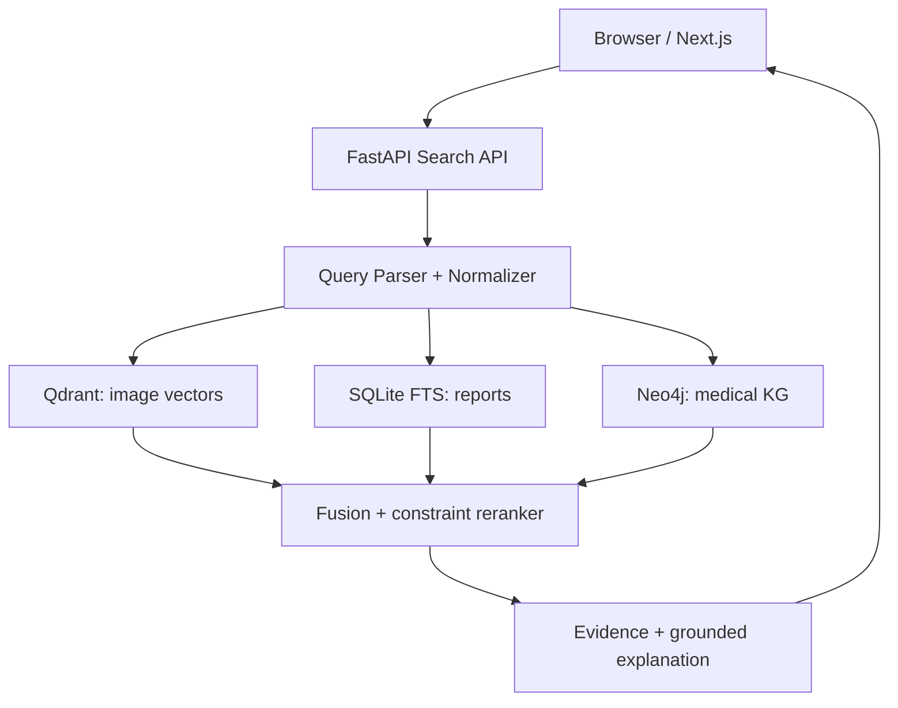
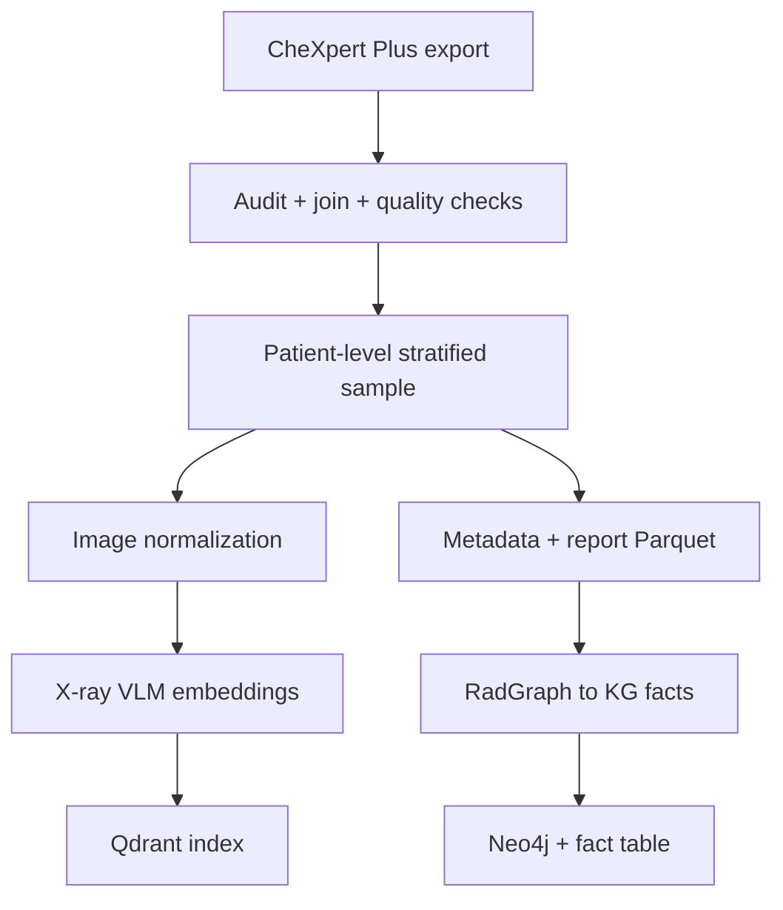
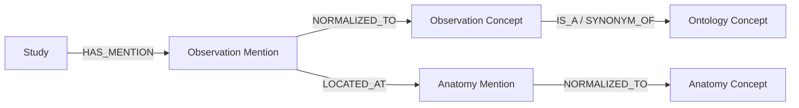

# Kế hoạch triển khai POC: Semantic Retrieval cho ảnh X-quang ngực với LLM và Knowledge Graph

> **Phiên bản:** 2.0  
> **Phạm vi triển khai:** POC chạy hoàn toàn trên máy local bằng Docker Compose; chưa triển khai cloud/production  
> **Nguồn dữ liệu chính:** ảnh từ CheXpert-v1.0-small, text/annotation từ CheXpert Plus, join bằng `path_to_image`  
> **Giới hạn ổ đĩa:** đo được 215 GB trống; hard ceiling 120 GB, working target 25–40 GB, luôn giữ ≥ 40 GB trống  
> **Phần cứng mục tiêu:** i7-13800H (20 threads), 64 GB RAM, NVIDIA RTX 2000 Ada 8 GB VRAM, Docker 29.5 + Compose v5  
> **Thời lượng đề xuất:** 12 tuần cho một người thực hiện

### Thay đổi so với v1.0

| # | Thay đổi | Lý do |
|---|---|---|
| 1 | Ảnh lấy từ CheXpert-v1.0-small thay vì tải PNG/DICOM của CheXpert Plus | Encoder nhận 224 px còn bản small đã có cạnh ngắn 320 px, nên độ phân giải dôi ra của PNG gốc bị vứt bỏ ở bước tiền xử lý; 11 GB thay vì 60–75 GB, đủ chỗ index toàn bộ 223k ảnh |
| 2 | Ngân sách đĩa nới từ 75 GB lên 120 GB; corpus mục tiêu có thể lên toàn bộ ảnh frontal | Đo lại thực tế: 215 GB trống, không phải 100 GB |
| 3 | Ingestion chạy trên GPU, serving thuần CPU | Máy có RTX 2000 Ada 8 GB; embedding 223k ảnh ~1–2 giờ thay vì hàng chục giờ CPU |
| 4 | Thêm Phase 2B — walking skeleton chạy Docker end-to-end từ tuần 2–3 | v1.0 xếp tầng theo chiều ngang, dồn toàn bộ rủi ro tích hợp và đóng gói về tuần 8–11 |
| 5 | Thiết kế đánh giá tách thành ba trục, trong đó human review là trục độc lập | v1.0 định nghĩa relevance bằng chính RadGraph mà hybrid dùng để lọc → circular evaluation, kết quả không bảo vệ được |
| 6 | Bỏ Recall@K cho query đơn nhãn; ngưỡng nghiệm thu chuyển sang tương đối | Tập relevant của query đơn nhãn có hàng nghìn study, Recall@10 trần ~0,005 nên vô nghĩa |
| 7 | `study_facts.parquet` là artifact chính tắc duy nhất; Neo4j nạp từ nó | v1.0 để fact table và Neo4j song song → nguy cơ lệch dữ liệu |
| 8 | Gộp `apps/api` vào package `src/cxr_retrieval` | API và worker dùng chung toàn bộ tầng retrieval/graph/query, không nên quản lý dependency ở hai nơi |

---

## 1. Tóm tắt quyết định thiết kế

Sản phẩm cần xây là một **công cụ tìm kiếm ngữ nghĩa cho kho ảnh X-quang ngực**, không phải hệ thống tự động chẩn đoán. Người dùng nhập truy vấn tự nhiên như:

> Find chest X-rays showing left lower lung opacity without pleural effusion.

Hệ thống phân tích truy vấn thành các điều kiện y khoa có cấu trúc, kết hợp:

1. **Vector retrieval** trên embedding ảnh để tìm ảnh phù hợp về mặt thị giác-ngôn ngữ.
2. **Text retrieval** trên phần `Findings` và `Impression` của báo cáo.
3. **Knowledge Graph filtering/reranking** để xử lý khái niệm, vị trí giải phẫu, phủ định và mức độ không chắc chắn.
4. **Grounded explanation** để chỉ ra vì sao từng kết quả được trả về, kèm đoạn bằng chứng trong báo cáo.

POC dùng **tối đa một ảnh frontal đại diện cho mỗi study**. Kích thước corpus không chốt cứng từ đầu mà do kết quả join ở Phase 1 quyết định: mục tiêu là toàn bộ ảnh frontal join được (~190k), sàn chấp nhận được là 25.000 study stratified. Ảnh lấy từ bản CheXpert-v1.0-small đã downsample nên không cần giữ DICOM hay convert hàng loạt; chỉ chuẩn hóa grayscale và cap cạnh dài ở 512 px, không upscale.

### Kết quả cuối cùng phải có

- Web UI cho phép tìm bằng tiếng Anh; hỗ trợ tiếng Việt ở mức dịch/chuẩn hóa truy vấn nếu LLM đạt yêu cầu.
- Trả về top-K ảnh, điểm phù hợp, report, nhãn và bằng chứng.
- Hỗ trợ truy vấn một dấu hiệu, nhiều dấu hiệu, phủ định và vị trí giải phẫu.
- Có chế độ so sánh `Vector only` với `Hybrid: Vector + Text + KG`.
- Có benchmark định lượng và bộ query kiểm thử tái lập được.
- Toàn bộ ứng dụng chạy bằng `docker compose up` trên local.
- Có README, tài liệu dữ liệu, hướng dẫn demo, test và báo cáo giới hạn của POC.

---

## 2. Bối cảnh dữ liệu và các giả định cần khóa

Theo mô tả chính thức, CheXpert Plus gồm 223.462 cặp ảnh–report, 187.711 study và 64.725 bệnh nhân. Ảnh gốc ở định dạng DICOM kèm 47 metadata element, có thêm bản chuyển PNG; report được chia thành nhiều section; dữ liệu có 14 nhãn CheXbert và annotation RadGraph-XL cho `Findings`/`Impression`.

### Khảo sát thực tế trên Redivis

Đã kiểm tra trực tiếp cổng phân phối. Tổng dataset **6,8 TB / 434.459 file**, chia thành:

| Folder | Số file | Ghi chú |
|---|---:|---|
| `DICOM_compressed` | 18 | 17 chunk × 156 GB + 1 chunk 91 GB ≈ **2,74 TB** |
| `DICOM_train` / `DICOM_valid` | 210,7K / 229 | File DICOM riêng lẻ |
| `PNG_compressed` | 5 | Bản nén theo chunk |
| `PNG_train` / `PNG_valid` | **223,2K** / 234 | **File PNG riêng lẻ — tải chọn lọc được** |
| `CheXpert Labels` | 3 | `findings_fixed.json`, `impression_fixed.json`, `report_fixed.json`, mỗi file 84 MB |
| `RadGraph XL Annotations` | 2 | |

Hai kết luận:

1. **DICOM loại hoàn toàn.** 2,74 TB chỉ riêng bản nén.
2. **Redivis có cho tải từng ảnh PNG một.** `PNG_train` phơi ra 223,2K file riêng lẻ chứ không chỉ archive. Ước lượng bằng phép trừ, bộ PNG khoảng 500–700 GB → ~2–3 MB mỗi ảnh; phải xác nhận lại bằng cột Size khi lọc Files theo `PNG_train`. Với 25.000 ảnh thì tương đương 60–75 GB, vẫn nằm trong 215 GB trống.

### Quyết định v2.0 về nguồn ảnh

Mặc dù PNG của Plus tải chọn lọc được, POC vẫn lấy **phần ảnh từ CheXpert-v1.0-small** — JPEG đã downsample, ~11 GB cho toàn bộ 223k ảnh — và ghép với **phần text/annotation của CheXpert Plus**. Đây là lựa chọn cho toàn bộ POC, không phải bước đệm.

Lý do quyết định là **độ phân giải đầu vào của model**: BiomedCLIP và CheXzero đều nhận ảnh 224×224, trong khi CheXpert-v1.0-small đã có cạnh ngắn 320 px; ảnh hiển thị thì cap ở 512 px. Toàn bộ độ phân giải dôi ra của PNG gốc bị vứt bỏ ngay ở bước tiền xử lý, ở cả nhánh embedding lẫn nhánh hiển thị. Trả thêm 60–75 GB để lấy về thông tin mà pipeline không đọc tới là một đánh đổi tồi — nhất là khi phần dung lượng tiết kiệm được cho phép index **toàn bộ 223k ảnh thay vì 25k**. Corpus lớn gấp chín lần là khác biệt thật trong một hệ retrieval; độ phân giải dôi ra thì không.

Khóa join là `path_to_image`, xuất hiện trong cả `df_chexpert_plus_240401.csv`, file RadGraph-XL và file CheXbert JSONL, cùng dạng đường dẫn `patientXXXXX/studyY/viewZ_*.jpg` với bản small.

**Khi nào chuyển sang PNG của Plus.** Đúng ba trường hợp: (1) join gate thất bại dưới 70%; (2) cần viewer zoom full-res như tính năng "could have"; (3) mở rộng sang bài toán cần chi tiết mảnh — nằm ngoài phạm vi POC. Ở cả ba, việc chuyển chỉ động vào tầng `data/`; embedding, KG, retrieval và UI không phải sửa.

Đánh đổi phải ghi nhận trong `docs/limitations.md`: ảnh small đã mất độ phân giải gốc, không dùng được cho bất kỳ nhận định nào về chi tiết mảnh như nốt nhỏ hay đường viền màng phổi. Với bài toán retrieval ở mức finding/anatomy thì đây là đánh đổi chấp nhận được, nhưng nó là một giới hạn thật, không phải chi tiết kỹ thuật.

### 2.1. Những gì sẽ dùng

| Thành phần | Nguồn | Mục đích |
|---|---|---|
| Ảnh JPEG downsample | CheXpert-v1.0-small | Hiển thị và tạo image embedding |
| `section_findings`, `section_impression` | `df_chexpert_plus_240401.csv` | Text search, trích bằng chứng, tạo explanation |
| `path_to_image` | Cả ba nguồn | Khóa join duy nhất giữa ảnh, report, label và annotation |
| Patient/study identifier suy ra từ đường dẫn | Đường dẫn ảnh | Chia tập theo patient, chống leakage |
| View/projection metadata | CSV của Plus | Ưu tiên frontal AP/PA, loại lateral khỏi corpus chính |
| 14 nhãn CheXbert | JSONL của Plus | Sampling phân tầng; **ground truth cho trục retrieval quality** |
| RadGraph-XL annotations | JSON của Plus | Xây entity/relation graph; **nguồn cho constraint, không dùng làm ground truth retrieval** |
| Demographic metadata tối thiểu | CSV của Plus | Kiểm tra phân bố; không đưa vào UI nếu không cần |

Việc tách vai trò của CheXbert và RadGraph ở hai dòng cuối là cố ý — xem §8.0 về circular evaluation.

### 2.2. Những gì không làm trong POC

- Không huấn luyện VLM từ đầu.
- Không dùng sản phẩm để đưa ra chẩn đoán hoặc khuyến nghị điều trị.
- Không tích hợp PACS/HIS thật.
- Không xử lý ảnh ngoài X-quang ngực.
- Không cố ingest toàn bộ UMLS/SNOMED CT.
- Không tải DICOM; không dùng ảnh độ phân giải gốc.
- Không đánh giá lâm sàng như một thiết bị y tế.

### 2.3. Cổng chặn Phase 1 — đo tỉ lệ join trước khi tải ảnh

Toàn bộ thiết kế v2.0 đứng trên một giả định chưa được kiểm chứng: đường dẫn ảnh của CheXpert-v1.0-small khớp với `path_to_image` của CheXpert Plus. Phải đo trước, trên metadata, khi chưa tải một tấm ảnh nào:

| Tỉ lệ join đo được | Hành động |
|---|---|
| ≥ 95% | Corpus mục tiêu là toàn bộ ảnh frontal join được (~190k). Index Qdrant chỉ ~400 MB, embedding ~1–2 giờ GPU. |
| 70–95% | Quay về corpus 25.000 study stratified như v1.0; ghi missing rate và nguyên nhân vào `docs/data-dictionary.md`. |
| < 70% | Dừng, không chữa cháy bằng fuzzy matching. Chuyển sang tải chọn lọc từ `PNG_train` trên Redivis (~60–75 GB cho 25k ảnh) và đánh giá lại ngân sách. |

### 2.4. Ràng buộc bắt buộc

- Đọc và lưu bản license/terms hiện hành của **cả hai** dataset trong `docs/data-governance/`.
- Xác nhận tài khoản có quyền tải và hình thức export hiện tại của từng nguồn.
- Kiểm tra kích thước thật của từng bảng/file trước khi export.
- Không commit ảnh, report hoặc identifier của dataset vào Git.
- Không gửi report/ảnh sang API bên thứ ba nếu điều khoản dữ liệu không cho phép. Cấu hình mặc định của POC là LLM local hoặc rule-based fallback.
- Ghi rõ trong UI: “Research/education POC — not for diagnosis”.

Nguồn tham khảo chính thức:

- [Stanford AIMI — CheXpert Plus](https://aimi.stanford.edu/datasets/chexpert-plus)
- [CheXpert Plus paper](https://arxiv.org/html/2405.19538)
- [Stanford-AIMI/chexpert-plus](https://github.com/Stanford-AIMI/chexpert-plus)
- [Stanford AIMI — CheXpert (bản gốc, có v1.0-small)](https://aimi.stanford.edu/datasets/chexpert-chest-x-rays)

---

## 3. Định nghĩa sản phẩm POC

### 3.1. Người dùng mục tiêu

- Bác sĩ chẩn đoán hình ảnh cần tìm case tham khảo trong kho cũ.
- Nghiên cứu viên cần tạo cohort theo biểu hiện lâm sàng.
- Kỹ sư/nhà khoa học dữ liệu y tế cần kiểm tra dữ liệu theo concept.

### 3.2. User stories bắt buộc

1. **Single finding:** tìm ảnh có `cardiomegaly`.
2. **Multi-finding:** tìm ảnh có `cardiomegaly` và `pulmonary edema`.
3. **Negation:** tìm `pulmonary edema without pleural effusion`.
4. **Anatomy:** tìm `left lower lung opacity`.
5. **Uncertainty:** phân biệt `present`, `absent`, `uncertain`, `not mentioned`.
6. **Explainability:** mở một kết quả và xem concept, quan hệ KG, nhãn và đoạn report đã hỗ trợ kết quả.
7. **Baseline comparison:** chuyển giữa vector-only và hybrid để thể hiện giá trị của LLM + KG.

### 3.3. Luồng demo chuẩn

1. Người dùng nhập: `Find left lower lung opacity without pleural effusion`.
2. UI hiển thị truy vấn được parse:
   - include: `lung opacity`, location: `left lower lung`;
   - exclude: `pleural effusion`;
   - uncertain policy: không chấp nhận uncertain cho điều kiện bắt buộc.
3. Hệ thống trả về top 10 ảnh.
4. Mỗi card hiển thị ảnh, view, score tổng, matched concepts và report evidence.
5. Người dùng mở “Why matched?” để xem đóng góp của image vector, text, KG và các constraint.
6. Người dùng chuyển sang `Vector only` để thấy một số kết quả vi phạm phủ định hoặc vị trí giải phẫu.

---

## 4. Kiến trúc tổng thể



### 4.1. Offline ingestion



### 4.2. Thành phần runtime

| Service | Vai trò | Ghi chú local |
|---|---|---|
| `web` | Next.js UI | Chỉ gọi API nội bộ |
| `api` | FastAPI orchestration | Query parsing, search, fusion, explanation; CPU-only |
| `qdrant` | Image vector index | Named volume; cosine similarity |
| `neo4j` | Knowledge Graph | Community edition; named volume; nạp từ fact table |
| `ollama` | Parse query thành JSON | Mặc định chạy native trên host; profile `local-llm` là phương án portable; có rule fallback |
| `worker` | Ingestion/embedding CLI | Profile `worker` + `compose.gpu.yaml`; không bật khi demo |

### 4.3. Lý do không thêm PostgreSQL trong bản đầu

Metadata đã được xử lý thành Parquet và SQLite/FTS5, đủ cho corpus 25 nghìn ảnh. Không thêm PostgreSQL giúp giảm RAM, Docker image, volume và độ phức tạp vận hành. Nếu cần scale hoặc nhiều người dùng, PostgreSQL là bước mở rộng sau POC.

---

## 5. Thiết kế dữ liệu

### 5.1. Đơn vị dữ liệu

- **Patient:** chỉ dùng identifier đã de-identify để chống leakage.
- **Study:** đơn vị liên kết report và một hoặc nhiều ảnh.
- **Image:** POC chọn tối đa một ảnh frontal đại diện cho mỗi study.
- **Report:** ưu tiên `Impression`; dùng thêm `Findings` khi có.
- **Mention:** entity cụ thể được RadGraph trích từ một đoạn report.
- **Concept:** khái niệm đã chuẩn hóa để dùng chung giữa report và query.

### 5.2. Master table

Lưu ở `data/processed/studies.parquet` với các trường tối thiểu:

| Nhóm | Trường |
|---|---|
| ID | `patient_id`, `study_id`, `image_id` |
| File | `source_path`, `processed_image_path`, `checksum` |
| Image | `view`, `width`, `height`, `is_frontal`, `quality_status` |
| Text | `findings`, `impression`, `search_text` |
| Labels | 14 label columns hoặc `labels_json` |
| Split | `development`, `validation`, `test` theo patient |
| Provenance | dataset version, source row, transform version |

### 5.3. Chuẩn hóa nhãn

Không gộp bừa bốn trạng thái của CheXpert:

| Giá trị nguồn | Trạng thái chuẩn |
|---:|---|
| `1` | `PRESENT` |
| `0` | `ABSENT` |
| `-1` | `UNCERTAIN` |
| null/NaN | `NOT_MENTIONED` |

Quy tắc mặc định:

- Điều kiện `include` chỉ nhận `PRESENT`.
- Điều kiện `exclude` yêu cầu `ABSENT`; `NOT_MENTIONED` không được coi là bằng chứng phủ định.
- `UNCERTAIN` được hiển thị riêng và chỉ được nhận nếu query cho phép.

### 5.4. Mô hình Knowledge Graph



Thuộc tính của `Observation Mention`:

- `status`: present/absent/uncertain;
- `section`: findings/impression;
- `text_span`, `start`, `end`;
- `source`: RadGraph-XL;
- `study_id` và provenance.

Các relation tối thiểu:

- `HAS_MENTION`
- `NORMALIZED_TO`
- `LOCATED_AT`
- `MODIFIES`
- `SUGGESTIVE_OF`
- `IS_A`
- `SYNONYM_OF`

**`study_facts.parquet` là artifact chính tắc duy nhất của tầng KG.** Nó có dạng phẳng:

```text
study_id | concept_id | concept_name | status | anatomy_id | section | evidence
```

Luồng bắt buộc là một chiều: `RadGraph JSON → facts_builder → study_facts.parquet → neo4j_loader → Neo4j`. Neo4j không bao giờ được ghi từ nguồn khác và không bao giờ là nguồn sự thật. Lý do: v1.0 để hai nơi cùng giữ dữ liệu KG song song, và bất kỳ thay đổi nào ở normalization cũng sẽ làm hai bên lệch nhau mà không có cách phát hiện.

Phân vai sau khi nạp: Neo4j phục vụ reasoning nhiều bước, provenance và visualization subgraph trong UI; fact table phục vụ hard filter ở runtime, unit test và batch evaluation. Một integration test phải kiểm tra rằng đếm node/edge trong Neo4j khớp với fact table sau mỗi lần load.

### 5.5. Ontology nhỏ của POC

Chỉ xây khoảng 100–300 concept phổ biến:

- 14 pathology chính;
- các synonym phổ biến, ví dụ `enlarged heart → cardiomegaly`;
- anatomy: lung, left/right lung, upper/middle/lower zone/lobe, base, apex, pleura, mediastinum;
- quan hệ `IS_A`, `PART_OF`, `SYNONYM_OF`.

Không cần tải toàn bộ UMLS. Mỗi mapping thủ công phải có version, nguồn và test.

---

## 6. Chiến lược dung lượng và corpus

Đo thực tế trên máy mục tiêu: **215 GB trống**. Giả định 100 GB của v1.0 sai, và nó đã khiến v1.0 siết corpus xuống 25k một cách không cần thiết. Kỷ luật dung lượng vẫn giữ, nhưng nó không còn là ràng buộc chi phối thiết kế.

### 6.1. Quy tắc dung lượng

- **Hard ceiling:** dừng pipeline khi thư mục dự án vượt 120 GB hoặc ổ đĩa còn dưới 40 GB.
- **Working target:** 25–40 GB trong lúc build; 20–30 GB ở trạng thái demo ổn định.
- Docker cache, model cache và WSL2 virtual disk phải nằm trong ngân sách, không coi là “ngoài dự án”.
- Lưu ý Windows: WSL2 không tự trả lại dung lượng khi xóa file trong container. Phải chạy `wsl --manage docker-desktop-data --set-sparse true` hoặc compact định kỳ; disk guard phải đo cả `ext4.vhdx`.

### 6.2. Ngân sách dự kiến (kịch bản corpus đầy đủ ~190k ảnh frontal)

| Hạng mục | Ngân sách tối đa |
|---|---:|
| CheXpert-v1.0-small, toàn bộ ảnh nguồn | 12 GB |
| Metadata, reports, CheXbert labels, RadGraph annotations | 8 GB |
| Ảnh chuẩn hóa 512 px + thumbnail | 18 GB |
| Embeddings và Qdrant index | 2 GB |
| Neo4j graph + SQLite FTS + Parquet | 8 GB |
| Model weights/tokenizer/cache (VLM + LLM 7B-Q4) | 15 GB |
| Docker images, named volumes, WSL2 overhead | 25 GB |
| Logs, benchmark output, temporary files | 5 GB |
| **Đỉnh dự kiến** | **93 GB** |
| **Khoảng trống bảo vệ** | **≥ 120 GB** |

Ở kịch bản sàn (corpus 25k), đỉnh dự kiến rơi về khoảng 45 GB. Các số trên là quota thiết kế, không phải kích thước chính thức. Task audit phải đo lại trước khi tải.

### 6.3. Chiến lược chọn corpus

Nếu Phase 1 cho tỉ lệ join ≥ 95%, lấy toàn bộ ảnh frontal và bỏ qua bước sampling — chỉ cần chia split theo patient. Phần dưới đây áp dụng cho **kịch bản sàn 25.000 study**.

1. Lọc các study có `Impression`; ưu tiên có cả `Findings`.
2. Chỉ giữ ảnh frontal AP/PA; nếu study có nhiều ảnh frontal, chọn theo quy tắc xác định trước.
3. Chia patient-level trước khi sampling để một patient không xuất hiện ở nhiều split benchmark.
4. Stratified sampling theo 14 labels, oversample các lớp hiếm nhưng giữ một phần phân bố tự nhiên.
5. Bảo đảm có đủ case:
   - positive/negative/uncertain;
   - single finding/multiple findings;
   - RadGraph có anatomy relation;
   - no finding.
6. Seed sampling cố định và lưu `sample_manifest.parquet`.

Phân bổ gợi ý:

| Split | Số study | Mục đích |
|---|---:|---|
| Development corpus | 18.000 | Xây index, kiểm tra và tuning |
| Validation query source | 3.500 | Chọn trọng số, threshold |
| Test query source | 3.500 | Báo cáo cuối, không tuning |
| **Tổng** | **25.000** | Một ảnh frontal/study |

Toàn bộ 25.000 ảnh có thể nằm trong retrieval corpus; split điều khiển nguồn tạo query và tránh tuning trên test.

### 6.4. Vòng đời file ảnh

```text
download CheXpert-v1.0-small archive
    → verify checksum, extract
    → join with Plus metadata on path_to_image
    → keep frontal AP/PA only, one image per study
    → grayscale, cap long side at 512 px (no upscaling), strip metadata
    → visual QC sample
    → generate embedding on GPU
    → keep processed images; archive gốc có thể xóa sau khi QC đạt
```

Vì bản small đã là JPEG downsample nên không còn bước DICOM windowing/inversion. Đây là lý do chính khiến pipeline v2.0 đơn giản hơn v1.0 đáng kể.

### 6.5. Disk guard bắt buộc

Tạo `scripts/check_disk_budget.py` chạy trước và sau mỗi batch:

- in dung lượng theo thư mục, bao gồm cả WSL2 `ext4.vhdx`;
- fail nếu free space < 40 GB;
- fail nếu tổng thư mục dự án > 120 GB;
- dọn cache tạm theo allowlist, không xóa recursive theo path không kiểm chứng;
- ghi `artifacts/storage_report.json`.

---

## 7. Thiết kế retrieval và reasoning

### 7.1. Query schema

LLM chỉ chuyển query thành JSON theo schema, không tự quyết định kết quả:

```json
{
  "include": [
    {
      "concept": "lung opacity",
      "status": "present",
      "anatomy": "left lower lung",
      "certainty": "definite"
    }
  ],
  "exclude": [
    {
      "concept": "pleural effusion",
      "status": "absent"
    }
  ],
  "view": "frontal",
  "free_text": "left lower lung opacity without pleural effusion"
}
```

Pipeline parser:

1. LLM structured output.
2. Pydantic validation.
3. Concept normalization bằng dictionary/ontology.
4. Nếu lỗi: retry một lần.
5. Nếu vẫn lỗi: rule-based parser + search free-text.
6. UI cho người dùng xem và sửa interpretation trước khi search lại.

### 7.2. Candidate generation

- **Image vector:** encode query bằng text encoder của X-ray VLM; lấy top 100 từ Qdrant.
- **Report search:** SQLite FTS5 trên `Findings + Impression`; lấy top 100.
- **KG match:** lấy study thỏa include/exclude/anatomy/status; hard-filter hoặc tạo bonus tùy loại query.

### 7.3. Fusion và reranking

Baseline:

```text
score = cosine(query_text_embedding, image_embedding)
```

Hybrid đề xuất:

```text
candidate set = union(vector_top_100, text_top_100, kg_matches)
score = RRF(image_rank, text_rank)
        + concept_match_bonus
        + anatomy_match_bonus
        - constraint_violation_penalty
```

Quy tắc an toàn:

- `exclude` có bằng chứng `PRESENT` → loại kết quả.
- `exclude` là `NOT_MENTIONED` → không gọi là “absent”; có thể hạ hạng hoặc loại tùy chế độ strict.
- anatomy không khớp → hạ hạng mạnh; chỉ hard-filter khi parser đủ tin cậy.
- LLM không được sinh bằng chứng không có trong report/KG.

### 7.4. Explanation

Mỗi kết quả phải có explanation có cấu trúc:

- matched concepts;
- satisfied/violated constraints;
- report evidence span;
- vector similarity và rank;
- nguồn evidence: label, report hoặc RadGraph;
- cảnh báo nếu chỉ dựa trên similarity mà thiếu bằng chứng cấu trúc.

Nên render từ template thay vì để LLM viết tự do. LLM chỉ được dùng để diễn đạt lại sau khi mọi fact đã được xác minh.

---

## 8. Giao diện POC

### 8.1. Search page

- Search box và các example query.
- Toggle `Vector only` / `Hybrid`.
- Strictness cho absent/uncertain.
- Parsed query chips có thể chỉnh sửa.
- Filter theo AP/PA, pathology, certainty.

### 8.2. Result card

- Ảnh X-quang có zoom/window cơ bản.
- Study ID đã de-identify, view và split.
- Overall score; không gọi là xác suất bệnh.
- Matched concept và constraint status.
- Trích đoạn `Impression`/`Findings`.

### 8.3. Detail drawer/page

- Report đầy đủ theo section.
- “Why matched?” với score breakdown.
- KG subgraph chỉ gồm các node/edge liên quan.
- Provenance và cảnh báo hạn chế.

### 8.4. Evaluation page

- Chọn query benchmark.
- Hiển thị kết quả baseline và hybrid cạnh nhau.
- Metrics tổng hợp theo query type.
- Cho phép đánh dấu relevant/not relevant phục vụ human review.

---

## 9. Cấu trúc repository đề xuất

API và worker được gộp vào **một package Python duy nhất** `src/cxr_retrieval`, thay vì tách `apps/api` riêng như v1.0. Lý do: cả hai dùng chung toàn bộ tầng `retrieval`, `graph`, `query`; tách ra buộc phải khai báo và pin dependency ở hai nơi cho cùng một code. Hai Dockerfile khác nhau cài cùng package với extras khác nhau.

```text
cxr-semantic-retrieval/
├── src/cxr_retrieval/
│   ├── api/                  # FastAPI: main, deps, routers/, schemas/
│   ├── cli/                  # typer entrypoints: ingest, index, graph, evaluate, seed
│   ├── data/                 # audit, join, sample, splits, labels, preprocess_images, master_table
│   ├── embeddings/           # encoder, batch_runner, qdrant_index
│   ├── graph/                # radgraph_parser, facts_builder, neo4j_loader, queries, schema.cypher
│   ├── query/                # schema, llm_parser, rule_parser, normalizer, ontology
│   ├── retrieval/            # vector, text_fts, kg_filter, fusion, rerank
│   ├── explanation/          # builder + templates/
│   ├── evaluation/           # benchmark_builder, metrics, runner, human_review
│   └── common/               # paths, config, logging, disk_guard, io
├── web/                      # Next.js
├── docker/                   # api.Dockerfile, worker.Dockerfile, web.Dockerfile, neo4j/, qdrant/
├── configs/                  # data, models, retrieval, ontology, evaluation (YAML)
├── data/                     # gitignored: raw/ staging/ processed/ manifests/ indexes/ fixtures/
├── artifacts/                # gitignored: metrics/ reports/ screenshots/
├── scripts/                  # check_disk_budget, download_*, seed_demo, smoke_test
├── tests/                    # unit/ integration/ e2e/ fixtures/
├── docs/                     # brief, architecture, data-dictionary, evaluation-design, adr/, data-governance/
├── compose.yaml              # mặc định CPU: web + api + qdrant + neo4j
├── compose.gpu.yaml          # override cho profile worker
├── pyproject.toml            # package + extras: api / worker / dev
├── .env.example  Makefile  .gitignore  .dockerignore  README.md
```

Không commit `data/`, model weights, Qdrant/Neo4j volumes hoặc report chứa dữ liệu nguồn. Ngoại lệ duy nhất là `data/fixtures/` — xem Phase 2B.

---

## 10. Kế hoạch theo phase và task

## Phase 0 — Chốt phạm vi và tiêu chí thành công (Tuần 1, ngày 1–2)

### Tasks

- [ ] Viết one-page product brief: problem, user, value, non-goals.
- [ ] Chốt 6 user stories bắt buộc và query demo chính.
- [ ] Chốt quy tắc corpus theo bảng §2.3 và hard ceiling 120 GB.
- [ ] Chốt rằng đây là retrieval POC, không phải diagnostic tool.
- [ ] Tạo backlog và Definition of Done cho từng phase.

### Deliverables

- `docs/product-brief.md`
- `docs/scope-and-non-goals.md`
- `docs/acceptance-criteria.md`

### Exit criteria

- Có thể mô tả giá trị sản phẩm trong 2–3 câu.
- Không còn yêu cầu mơ hồ về training, diagnosis hoặc deployment.

---

## Phase 1 — Data access, audit và storage spike (Tuần 1)

### Tasks

- [ ] Hoàn tất quyền truy cập và lưu license/terms của **cả** CheXpert Plus và CheXpert gốc.
- [ ] Liệt kê bảng/file khả dụng, schema, số dòng và kích thước.
- [ ] Tải metadata/report/CheXbert/RadGraph của Plus trước, chưa tải ảnh.
- [ ] **Cổng chặn:** đo tỉ lệ join `path_to_image` giữa CSV của Plus và cây thư mục của CheXpert-v1.0-small, trên toàn bộ CSV. Áp bảng quyết định ở §2.3.
- [ ] Phân tích dạng đường dẫn không khớp; phân loại nguyên nhân, không fuzzy match.
- [ ] Tải CheXpert-v1.0-small; verify checksum; đo kích thước thật.
- [ ] Đo GPU/RAM/thời gian embedding thử trên 500 ảnh, ngoại suy cho corpus mục tiêu.
- [ ] Xác nhận WSL2 GPU passthrough hoạt động với `docker run --gpus all`.
- [ ] Viết disk guard và storage report.

### Deliverables

- `docs/data-dictionary.md`
- `docs/data-governance/`
- `artifacts/data_audit.json` — có trường `join_rate` và phân loại missing
- `artifacts/storage_report.json`
- quyết định corpus: toàn bộ frontal hay 25k stratified

### Exit criteria

- Tỉ lệ join đã đo trên toàn bộ CSV, và corpus target đã chốt theo bảng §2.3.
- Có ước lượng peak storage dựa trên số đo thực, nhỏ hơn 120 GB.
- 500 ảnh đi qua preprocess và embedding thành công, có số đo throughput.

---

## Phase 2 — Sampling và canonical data pipeline (Tuần 2)

### Tasks

- [ ] Chuẩn hóa 4 trạng thái label.
- [ ] Tạo patient-level split bằng seed cố định.
- [ ] Xây stratified sampler cho kịch bản sàn 25.000 study (bỏ qua nếu join gate cho phép dùng toàn bộ frontal).
- [ ] Ưu tiên frontal AP/PA, tối đa một ảnh/study.
- [ ] Bảo toàn lớp hiếm và case có anatomy relation.
- [ ] Tạo `sample_manifest.parquet` có checksum/provenance.
- [ ] Viết kiểm tra duplicate patient/study/image.
- [ ] Viết data validation bằng Pandera hoặc Great Expectations nhẹ.

### Deliverables

- `data/manifests/sample_manifest.parquet`
- `data/processed/studies.parquet`
- báo cáo phân bố labels/views/splits

### Exit criteria

- Không có patient leakage giữa development/validation/test.
- 100% record có `study_id`, `image_id`, đường dẫn ảnh dự kiến.
- Phân bố lớp hiếm đạt quota đã chốt.
- Pipeline chạy lại cho kết quả giống nhau với cùng seed.

---

## Phase 2B — Walking skeleton (Tuần 2–3, chạy song song Phase 3)

Đây là phase mới của v2.0. Mục tiêu không phải chất lượng mà là **rủi ro**: chứng minh mọi service nói chuyện được với nhau, và `docker compose up` chạy được, ngay từ tuần 3 thay vì tuần 11. Mọi tầng ở mức stub đơn giản nhất có thể, chỉ cần đúng interface.

### Tasks

- [ ] Dựng `compose.yaml` với web + api + qdrant + neo4j, healthcheck đầy đủ.
- [ ] `/health` của API kiểm tra được kết nối tới Qdrant và Neo4j.
- [ ] Tạo `data/fixtures/` — **1.000 study** làm corpus tí hon để phát triển. Ảnh thật, nằm ngoài Git.
- [ ] Tạo thêm một fixture **~50 study dữ liệu tổng hợp** *có thể commit*: ảnh sinh bằng code, report viết tay, label và RadGraph giả lập đúng schema. Đây là thứ giúp một người clone repo chạy được demo mà không cần dataset.
- [ ] `make seed` nạp fixture tổng hợp vào Qdrant + Neo4j + SQLite.
- [ ] Nối thông một luồng duy nhất end-to-end: query text → rule parser → vector search → trả JSON → UI render grid ảnh.
- [ ] Stub có chủ đích: parser chỉ khớp keyword; embedding có thể là model nhỏ bất kỳ; KG chỉ có `HAS_MENTION`; explanation chỉ in concept khớp.
- [ ] Smoke test chạy trong CI cục bộ: `docker compose up` → `make seed` → gọi `/search` → assert có kết quả.

### Deliverables

- `compose.yaml`, ba Dockerfile, `Makefile` với target `up`/`seed`/`smoke`
- `data/fixtures/synthetic/` commit được
- `scripts/smoke_test.sh`

### Exit criteria

- Từ clean clone, không có dataset: `make up && make seed && make smoke` xanh.
- Restart toàn bộ container không mất index.
- Mọi phase sau chỉ thay stub bằng bản thật, không phải dựng lại hạ tầng.

---

## Phase 3 — Image preprocessing và quản lý dung lượng (Tuần 3)

### Tasks

- [ ] Xử lý theo batch 2.000–5.000 ảnh, có checkpoint/resume.
- [ ] Chuẩn hóa grayscale, giữ aspect ratio, cap cạnh dài ở 512 px. **Không upscale** — ảnh small chỉ khoảng 320×390 nên hầu hết sẽ giữ nguyên kích thước.
- [ ] Lưu ảnh hiển thị ở WebP chất lượng cao; strip toàn bộ metadata còn sót.
- [ ] Tạo thumbnail 256 px riêng cho result grid.
- [ ] QC tự động: corrupt file, empty image, min/max intensity, tỉ lệ khung hình bất thường.
- [ ] QC thủ công 200 ảnh, bao gồm AP/PA và pathology đa dạng.
- [ ] Dọn archive gốc sau khi QC và embedding đạt.

### Deliverables

- `data/processed/images/`
- `artifacts/image_qc_report.html` hoặc `.md`
- `artifacts/image_manifest.parquet`

### Exit criteria

- ≥ 99,5% ảnh đã chọn đọc và hiển thị được.
- Không có ảnh đảo trắng/đen sai trong mẫu QC.
- Processed images nằm trong quota §6.2; disk guard xanh trước và sau mỗi batch.

---

## Phase 4 — Vector retrieval baseline (Tuần 4)

### Tasks

- [ ] Chạy spike 2–3 pretrained X-ray VLM (BiomedCLIP, CheXzero, BioViL-T) trên 1.000 ảnh.
- [ ] Chọn một model theo chất lượng, VRAM, license và khả năng encode text query.
- [ ] Pin model revision và preprocessing config.
- [ ] Sinh image embeddings theo batch **trên GPU** (profile `worker` + `compose.gpu.yaml`), có checkpoint/resume.
- [ ] Normalize embedding và index vào Qdrant.
- [ ] Implement text query encoder và top-K cosine search; encoder này chạy CPU ở runtime.
- [ ] Tạo CLI và API baseline `/search/vector`.
- [ ] Kiểm tra deterministic mapping giữa vector ID và study ID.
- [ ] **Đo baseline trên bộ query nháp và ghi số vào `artifacts/metrics/baseline.json`.**

### Deliverables

- image embedding matrix + Qdrant collection
- `docs/model-card-poc.md`
- baseline search API
- `artifacts/metrics/baseline.json` — cơ sở để chốt ngưỡng ở Phase 8

### Exit criteria

- Toàn bộ corpus target được index đầy đủ.
- Search 20 query smoke test không crash.
- Kết quả luôn map đúng ảnh/report.
- Warm query latency vector search < 1 giây; toàn API baseline < 3 giây trên máy mục tiêu, không tính cold model load.
- **Đã có số baseline đo được. Không chốt bất kỳ ngưỡng nghiệm thu tuyệt đối nào trước mốc này.**

---

## Phase 5 — Text retrieval và evidence layer (Tuần 5)

### Tasks

- [ ] Chuẩn hóa `Findings` và `Impression` nhưng giữ bản gốc.
- [ ] Tạo SQLite FTS5 index.
- [ ] Implement query expansion bằng synonym dictionary.
- [ ] Trả về evidence span và section.
- [ ] Implement reciprocal rank fusion giữa image vector và text rank.
- [ ] Tạo score breakdown và logging phục vụ debug.

### Deliverables

- SQLite FTS index
- API `/search/hybrid-lite`
- evidence extraction tests

### Exit criteria

- Exact medical term retrieval hoạt động cho 14 pathology.
- Evidence trả về là substring có thật trong report.
- Có kết quả so sánh vector-only với vector+text.

---

## Phase 6 — Query parser bằng LLM và concept normalization (Tuần 6)

### Tasks

- [ ] Định nghĩa Pydantic query schema.
- [ ] Xây prompt và 50–100 few-shot/unit cases.
- [ ] Thử local instruct model nhỏ và đo latency/RAM.
- [ ] Implement provider abstraction: local LLM và deterministic fallback.
- [ ] Xây concept dictionary/synonym mapping versioned.
- [ ] Xử lý negation, certainty, laterality và anatomy.
- [ ] Cho UI hiển thị parsed query để người dùng xác nhận/sửa.
- [ ] Bảo vệ prompt injection: chỉ chấp nhận JSON schema và concept allowlist.

### Deliverables

- `/parse-query` API
- `configs/ontology.yaml`
- query parser benchmark

### Exit criteria

- Schema-valid rate ≥ 99% sau retry/fallback.
- Concept/status/anatomy macro-F1 ≥ 0,90 trên ít nhất 100 query đã gán nhãn.
- Query không hợp lệ không làm backend thực thi code hoặc Cypher tùy ý.

---

## Phase 7 — Knowledge Graph và KG-aware reranking (Tuần 7–8)

### Tasks

- [ ] Parse RadGraph annotations cho subset.
- [ ] Chuẩn hóa mention → concept; giữ span và provenance.
- [ ] Import node/edge vào Neo4j theo batch.
- [ ] Tạo indexes/constraints theo `study_id`, `concept_id`.
- [ ] Tạo mini-ontology 100–300 concept.
- [ ] Implement query templates cho include/exclude/anatomy/certainty.
- [ ] Không sinh Cypher trực tiếp từ LLM; dùng query builder có allowlist.
- [ ] Kết hợp KG hard constraints và soft bonus trong reranker.
- [ ] Render subgraph và explanation.

### Deliverables

- Neo4j import scripts
- graph schema document
- API `/search/hybrid`
- 20 integration tests cho phủ định/anatomy/uncertainty

### Exit criteria

- Truy vấn demo chính chạy end-to-end.
- 100% explanation fact có provenance về report/annotation/label.
- `ABSENT` khác `NOT_MENTIONED` trong cả API lẫn UI.
- Không có raw LLM text được dùng trực tiếp làm Cypher.

---

## Phase 8 — Evaluation và ablation study (Tuần 9)

### 8.0. Vấn đề circular evaluation và cách xử lý

Thiết kế v1.0 có một lỗi phương pháp phải sửa trước khi đo bất cứ thứ gì. Nó định nghĩa relevance bằng labels và RadGraph, trong khi hybrid pipeline lọc kết quả bằng **chính RadGraph đó**. Hệ quả tất yếu: hybrid đạt gần 100% còn vector-only rất thấp, và kết luận “LLM + KG cải thiện retrieval” trở thành một hệ quả của cách đặt đề bài chứ không phải một phát hiện. Đây là chỗ dễ bị hội đồng bắt lỗi nhất.

v2.0 tách thành ba trục, mỗi trục có nguồn sự thật riêng và cách diễn giải riêng:

| Trục | Ground truth | Trả lời câu hỏi | Diễn giải |
|---|---|---|---|
| **Retrieval quality** | CheXbert labels | Có tìm đúng ảnh không? | So sánh công bằng ba cấu hình. Nguồn nhãn khác nguồn constraint nên còn ý nghĩa, dù vẫn tương quan. |
| **Constraint compliance** | RadGraph-XL | Có tôn trọng phủ định và vị trí không? | Hybrid thắng **theo thiết kế**. Báo cáo như một tính chất của hệ thống, tuyệt đối không trình bày như thành tích retrieval. |
| **Human-judged** | 100–150 query, 2 người review độc lập | Kết quả có thật sự đúng không? | Trục độc lập duy nhất. Đây là trục có trọng lượng khi bảo vệ. |

Ba quy tắc bắt buộc:

1. CheXbert dùng cho ground truth, RadGraph dùng cho constraint. Không hoán đổi, không trộn.
2. Mọi phát biểu “hybrid tốt hơn” phải nói rõ đang ở trục nào.
3. Phần báo cáo phải có một mục thừa nhận thẳng rằng hai trục đầu vẫn tương quan vì cùng suy ra từ report, và human review tồn tại chính là để bù phần đó.

### 8.1. Sửa metric

Bỏ Recall@K cho query đơn nhãn. Với “cardiomegaly” trên corpus 25k–190k, tập relevant có hàng nghìn study nên Recall@10 có trần khoảng 0,005 và không diễn giải được. Thay bằng:

- **Mọi query:** Precision@5, Precision@10, nDCG@10, MRR.
- **Chỉ query có tập relevant < 50** (query ghép, lớp hiếm, có phủ định): thêm Recall@50.
- **Constraint compliance:** tỉ lệ kết quả top-10 không vi phạm điều kiện `exclude` và `anatomy`.

### Tasks

- [ ] Tạo benchmark 300–500 query từ CheXbert labels; **không sinh query từ RadGraph** để tránh rò rỉ vào trục 1.
- [ ] Không dùng nguyên văn report làm query; dùng template + paraphrase có kiểm tra.
- [ ] Chia query theo nhóm: simple, multi-finding, negation, anatomy, uncertainty.
- [ ] Chuẩn bị bộ 100–150 query cho human review; giao diện review ở §8.4 của UI.
- [ ] Hai lượt review độc lập cho trục 3; tính Cohen's kappa, báo cáo cả khi kappa thấp.
- [ ] Chạy ba cấu hình: vector only; vector + text; vector + text + LLM/KG.
- [ ] Tính metric theo §8.1, tách bảng theo từng trục.
- [ ] Đo latency p50/p95, VRAM, RAM và disk.
- [ ] Error analysis ít nhất 50 failure cases.

### Mục tiêu nghiệm thu

Ngưỡng được chốt **sau** khi có `artifacts/metrics/baseline.json` ở Phase 4, và phát biểu ở dạng tương đối so với baseline đó. Bảng dưới là khung, không phải số đã chốt:

| Hạng mục | Trục | Dạng ngưỡng |
|---|---|---|
| Simple label Precision@10 | 1 | Hybrid ≥ baseline, không được thụt lùi |
| nDCG@10 tổng hợp | 1 | Hybrid tốt hơn baseline ≥ 5% tương đối |
| Negation constraint satisfaction | 2 | ≥ 0,90 — đây là ngưỡng tuyệt đối hợp lệ vì đo tính đúng đắn logic, không phải chất lượng retrieval |
| Anatomy queries Precision@10 | 3 | Hybrid > baseline, có ý nghĩa trên bộ human-judged |
| Evidence faithfulness | 2 | 100% evidence tồn tại nguyên văn trong source |
| API p95, không tính cold start | — | ≤ 3 giây |
| End-to-end có LLM parser | — | ≤ 6 giây |

Hai mốc latency siết lại so với v1.0 (5s và 12s) vì v1.0 giả định CPU-only, còn máy mục tiêu có GPU và embedding đã precompute.

Nếu một ngưỡng không đạt, báo cáo trung thực và ưu tiên sửa query parsing, concept mapping hoặc dữ liệu trước khi đổi sang model lớn hơn.

### Deliverables

- `artifacts/metrics/evaluation.json` — tách kết quả theo ba trục
- `artifacts/reports/evaluation-report.md` — có mục thừa nhận giới hạn phương pháp
- bảng ablation và error taxonomy
- `artifacts/metrics/human_review.json` + chỉ số đồng thuận

---

## Phase 9 — Web UI và trải nghiệm demo (Tuần 10)

### Tasks

- [ ] Xây search page và result grid.
- [ ] Parsed query editor/chips.
- [ ] Image viewer, report panel và “Why matched?”.
- [ ] Toggle baseline/hybrid.
- [ ] Graph visualization giới hạn node liên quan.
- [ ] Empty/loading/error states.
- [ ] Disclaimer và privacy note.
- [ ] E2E test 6 user stories bắt buộc.

### Deliverables

- UI hoàn chỉnh
- demo seed queries
- screenshots/GIF phục vụ thuyết trình

### Exit criteria

- Người mới có thể chạy 6 luồng demo không cần sửa dữ liệu/code.
- Kết quả không gọi score là xác suất bệnh.
- Evidence và uncertainty được nhìn thấy rõ.

---

## Phase 10 — Hoàn thiện đóng gói Docker (Tuần 11)

Hạ tầng Compose đã tồn tại và chạy từ Phase 2B. Phase này là **hardening**, không phải dựng mới.

### Tasks

- [ ] Chuyển Dockerfile sang multi-stage, cắt image size, chạy bằng non-root user.
- [ ] Hoàn thiện profile `worker` (`compose.gpu.yaml`) và `local-llm`.
- [ ] Bind-mount ảnh ở chế độ `:ro`; index dùng named volume.
- [ ] Rà soát healthcheck, `depends_on: condition: service_healthy`, restart policy.
- [ ] Pin toàn bộ dependency, model revision và container tag; không dùng `latest`.
- [ ] Hoàn thiện `.env.example`; kiểm tra không có secret nào bị commit.
- [ ] Hoàn thiện Make targets: `setup`, `ingest`, `index`, `graph`, `up`, `seed`, `test`, `benchmark`, `smoke`, `down`, `clean`.
- [ ] Chạy thử từ clean clone và volume mới, **không có dataset**, chỉ fixture tổng hợp.
- [ ] Chạy thử lần hai **có dataset đầy đủ**, đo cold start.
- [ ] Xác nhận đường CPU-only hoạt động khi không có GPU.

### Compose profiles

```text
default:    web + api + qdrant + neo4j          (CPU, compose.yaml)
worker:     ingestion / embedding jobs          (GPU, + compose.gpu.yaml)
local-llm:  optional Ollama container           (hoặc trỏ LLM_BASE_URL sang Ollama trên host)
```

Mặc định là Ollama chạy native trên host và API gọi qua `host.docker.internal:11434`. Profile `local-llm` tồn tại để repo vẫn portable sang máy khác, nhưng GPU passthrough cho Ollama qua Docker Desktop trên Windows hay hỏng nên không đặt làm mặc định.

### Exit criteria

- `docker compose up -d` làm toàn bộ runtime healthy.
- `make seed` tạo được demo index từ fixture tổng hợp, không cần dataset.
- Restart container không mất index/graph.
- Không cần cài Python/Node trực tiếp để chạy demo.
- Tài liệu nêu rõ RAM/disk/CPU/GPU tối thiểu và thời gian cold start cho cả hai kịch bản.

---

## Phase 11 — Hardening, documentation và rehearsal (Tuần 12)

### Tasks

- [ ] Unit/integration/E2E test và regression query set.
- [ ] Kiểm tra corrupt index, missing image, LLM timeout và Neo4j unavailable.
- [ ] Thêm fallback: vector+text vẫn hoạt động nếu KG/LLM lỗi.
- [ ] Log structured nhưng không log toàn bộ dữ liệu không cần thiết.
- [ ] Viết README từ clean machine.
- [ ] Viết architecture decision records.
- [ ] Chuẩn bị demo script 7–10 phút.
- [ ] Ghi video backup của demo.
- [ ] Chạy final disk audit và xóa staging/cache không cần thiết.

### Deliverables

- `README.md`
- `docs/architecture.md`
- `docs/demo-script.md`
- `docs/limitations.md`
- test report và release tag `poc-v1.0`

### Exit criteria

- Clean-start demo thành công ít nhất 3 lần.
- Không còn blocker P0/P1.
- Tổng footprint ổn định nằm trong working target §6.1; không vượt hard ceiling 120 GB ở bất kỳ thời điểm nào.
- Báo cáo nêu rõ limitation, bias, synthetic labels và phạm vi non-diagnostic.

---

## 11. Ma trận kiểm thử

| Lớp test | Nội dung |
|---|---|
| Unit | label mapping, query schema, normalization, score fusion, disk guard |
| Data contract | schema, join coverage, duplicates, patient leakage, file checksums |
| Integration | FastAPI–Qdrant, FastAPI–Neo4j, FTS, model adapter |
| Retrieval regression | bộ 30–50 query cố định và top result expectations |
| E2E | 6 user stories trên browser |
| Failure | LLM timeout, KG down, vector DB down, missing image |
| Performance | p50/p95 latency, cold/warm start, RAM, disk usage |
| Explainability | evidence span tồn tại và đúng study |

---

## 12. Rủi ro chính và biện pháp giảm thiểu

| Rủi ro | Tác động | Giảm thiểu |
|---|---|---|
| **`path_to_image` không join được giữa CheXpert-small và Plus** | Sập toàn bộ đường dữ liệu v2.0 | Cổng chặn §2.3 đo trước khi tải ảnh; có đường lui về Redivis; không fuzzy match |
| **Circular evaluation** | Kết quả không bảo vệ được trước hội đồng | Tách ba trục ở §8.0; CheXbert cho ground truth, RadGraph cho constraint; human review độc lập |
| Recall@K vô nghĩa với query đơn nhãn | Metric sai lệch | §8.1: bỏ Recall cho query phổ biến, chỉ dùng khi tập relevant < 50 |
| Ngưỡng nghiệm thu đoán trước khi đo | Hoặc quá dễ hoặc không đạt được | Chốt ngưỡng sau baseline Phase 4; phát biểu ở dạng tương đối |
| Tích hợp và đóng gói dồn về cuối kỳ | Trễ tiến độ không cứu được | Phase 2B walking skeleton; Docker chạy từ tuần 3 |
| Ảnh small mất độ phân giải | Không nhận được chi tiết mảnh | Ghi vào `docs/limitations.md`; không tuyên bố gì về nốt nhỏ/chi tiết vi thể |
| WSL2 không trả lại dung lượng đã xóa | Đầy đĩa âm thầm | Disk guard đo cả `ext4.vhdx`; bật sparse; compact định kỳ |
| GPU passthrough Docker Desktop hỏng | Không embedding được trong container | Xác nhận ở Phase 1; đường lui là chạy worker trực tiếp trên host |
| VLM yếu với anatomy/negation | Kết quả sai | KG hard constraints + text evidence; ablation rõ ràng |
| Report mô tả nhiều ảnh trong cùng study | Image-report mismatch | Một ảnh frontal/study nhưng gắn cờ limitation; không tuyên bố lesion localization chính xác |
| Label sinh tự động không phải ground truth lâm sàng | Metrics lạc quan/sai | Human review subset; báo cáo synthetic-label limitation |
| `NOT_MENTIONED` bị hiểu là `ABSENT` | Sai logic phủ định | Giữ 4 trạng thái xuyên suốt pipeline |
| LLM parse sai | Search sai | Schema validation, allowlist, editable parsed query, fallback |
| Neo4j quá nặng | Runtime chậm/tốn đĩa | Chỉ subset; indexes; fact table; graph service có thể degrade gracefully |
| CPU local chậm | Demo giật | Precompute image vectors; model nhỏ; cache parser; warm-up trước demo |
| Docker/model cache vượt quota | Hết đĩa | Pin image, prune có kiểm soát, storage report định kỳ |
| License/privacy không rõ | Không thể dùng dữ liệu | Gate ở Phase 1; không gửi dữ liệu ra ngoài mặc định |

---

## 13. Ưu tiên khi thiếu thời gian

### Must have

- Corpus 10k–25k ảnh hoạt động ổn định.
- Vector retrieval + report FTS.
- LLM query parser có fallback.
- KG xử lý concept, negation và anatomy cơ bản.
- Evidence-grounded results.
- Evaluation vector vs hybrid.
- UI và Docker Compose local.

### Should have

- Editable parsed query.
- KG subgraph visualization.
- Vietnamese query normalization.
- Human relevance annotation page.

### Could have

- Similar-image search bằng ảnh query.
- Timeline theo patient.
- Fine-tune reranker/VLM.
- PACS/FHIR integration.

Nếu trễ tiến độ, giảm corpus xuống 10.000–15.000 study trước khi bỏ KG, evaluation hoặc Docker; các thành phần sau mới là phần chứng minh giá trị của đề tài.

---

## 14. Definition of Done cho POC

POC được coi là hoàn thành khi tất cả điều kiện sau đạt:

- [ ] Một người mới có thể chạy app từ README bằng Docker Compose, **kể cả khi không có dataset** (fixture tổng hợp).
- [ ] Có ít nhất 25.000 ảnh thực; mục tiêu toàn bộ ảnh frontal join được.
- [ ] Sáu user stories bắt buộc chạy đúng.
- [ ] Query parser xuất JSON hợp lệ và có fallback.
- [ ] Hybrid retrieval dùng thật vector, text và KG; không phải UI giả lập.
- [ ] Kết quả có evidence/provenance và phân biệt absent với not-mentioned.
- [ ] Có benchmark tái lập, tách rõ ba trục đánh giá, kèm human review.
- [ ] Báo cáo thừa nhận thẳng giới hạn phương pháp của trục 1 và 2.
- [ ] Có error analysis và limitations.
- [ ] Không vượt disk budget; staging đã được dọn.
- [ ] Không có secret hoặc dataset raw trong Git.
- [ ] Có disclaimer non-diagnostic.
- [ ] Có demo script và video backup.

---

## 15. Lịch 12 tuần tóm tắt

| Tuần | Trọng tâm | Mốc bàn giao |
|---:|---|---|
| 1 | Scope, access, **join gate**, storage audit | Corpus decision + measured budget |
| 2 | Sampling, split, master table + **khởi động skeleton** | Reproducible manifest |
| 3 | Image preprocessing + **walking skeleton xanh** | Clean 512 px corpus; `make up/seed/smoke` chạy |
| 4 | X-ray VLM + Qdrant | Vector baseline |
| 5 | Report FTS + evidence | Hybrid-lite |
| 6 | LLM parser + ontology | Structured query API |
| 7 | RadGraph ingestion + Neo4j | KG built |
| 8 | KG filtering/reranking | End-to-end hybrid search |
| 9 | Benchmark 3 trục + ablation | Metrics and error analysis |
| 10 | UI | Demo-ready workflow |
| 11 | Docker hardening | Reproducible local package |
| 12 | Hardening + rehearsal | `poc-v1.0` |

---

## 16. Checklist bắt đầu ngay

1. Đăng nhập Redivis, xin quyền CheXpert Plus, tải metadata/report/CheXbert/RadGraph. Chưa tải ảnh.
2. Xin quyền CheXpert gốc và ghi lại link tải bản `v1.0-small`.
3. **Chạy join gate:** đối chiếu `path_to_image` của CSV Plus với cây thư mục của bản small. Ghi `join_rate` vào `artifacts/data_audit.json` và áp bảng quyết định §2.3.
4. Tạo repository và `.gitignore` cho data/model/volume.
5. Tải bản small, verify checksum, chạy spike 500 ảnh để đo throughput preprocess/embedding trên GPU.
6. Xác nhận `docker run --gpus all` hoạt động trong WSL2.
7. Chốt corpus target, rồi mới xử lý ảnh theo batch.
8. Song song từ tuần 2: dựng walking skeleton (Phase 2B) để Docker chạy được sớm.

Kế hoạch này ưu tiên hoàn thành một sản phẩm **nhỏ hơn nhưng chạy thật, đo được và giải thích được**. Giá trị thực tiễn được chứng minh bằng khả năng tìm cohort/case theo ngôn ngữ tự nhiên, xử lý đúng phủ định/vị trí giải phẫu và truy vết bằng chứng — không phải bằng việc tải toàn bộ dữ liệu hoặc huấn luyện một model rất lớn.
